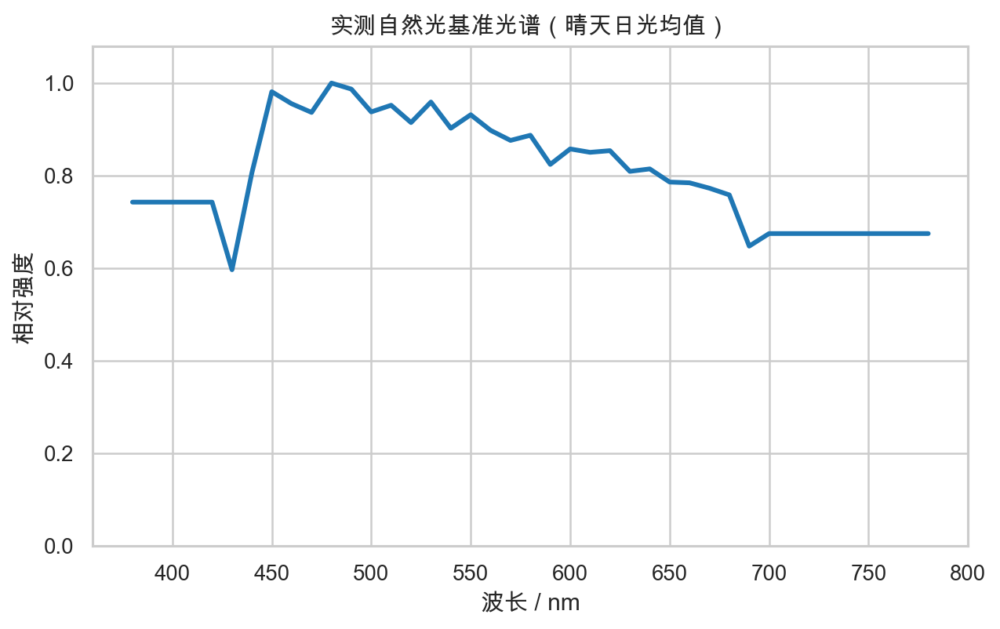
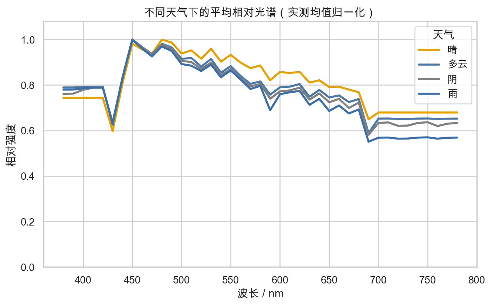
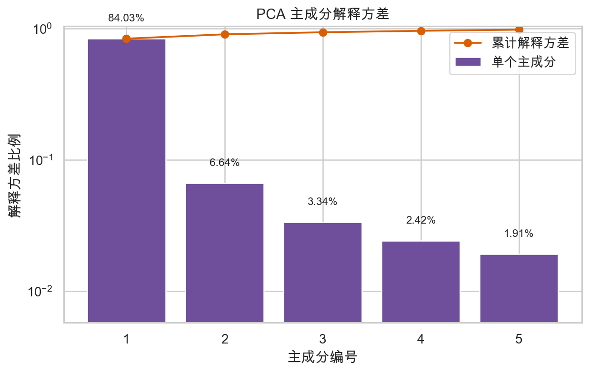
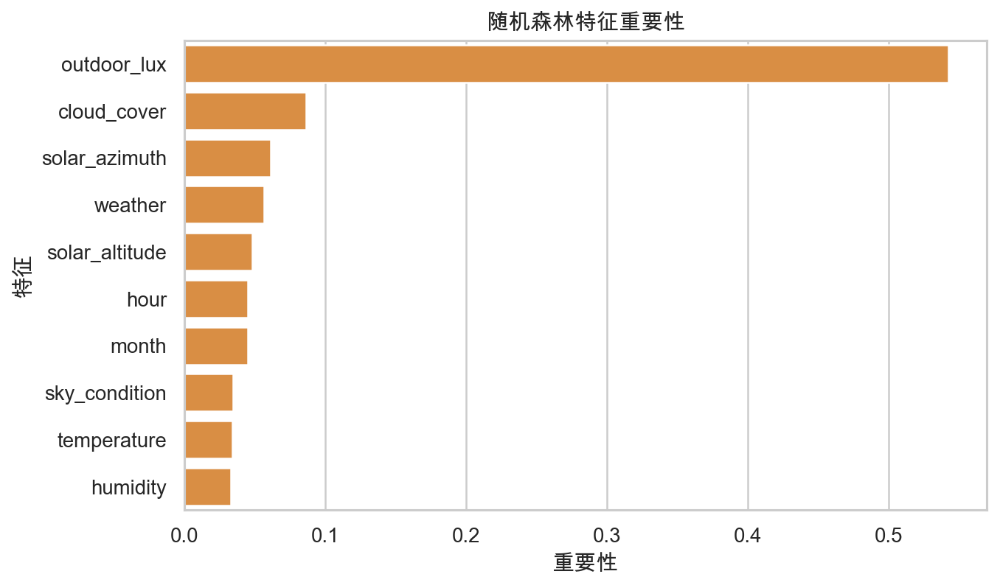
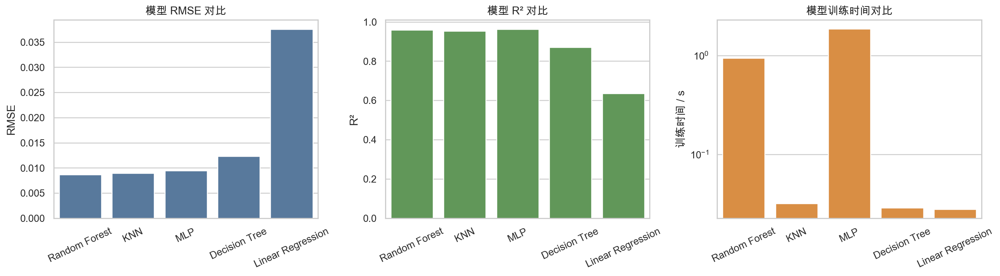
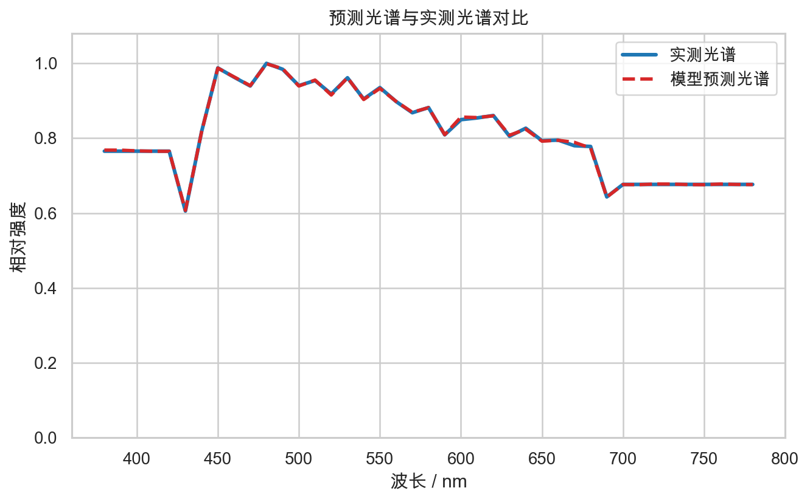
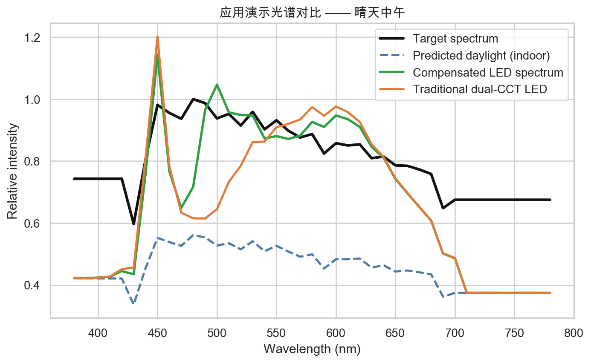

# 第24组_课程答辩

- Source: `第24组_课程答辩.pptx`
- Total slides: 10

## Slide 1

- PYTHON
- COURSE
- DESIGN

答辩时间约 6 分钟

- 基于真实天光数据的
- 自然光光谱估计与
- 室内照明补偿设计

- 课程名称：Python 应用开发基础
- 小组成员：李安逸、黄奕滔

内容主线：光谱问题 → 数据建模 → LED 补偿应用

41

5664

98.3%

VISIBLE WAVELENGTH POINTS

REAL SAMPLES

PCA CUM. VAR.

内容概览

本项目先说明为什么亮度和色温不足以描述照明质量，再说明如何用真实数据训练模型，最后展示预测光谱怎样进入 LED 补偿应用。

项目定位

本项目是课程设计中的算法原型，重点展示 Python 数据处理、PCA 降维、模型对比和可视化结果，不把它夸大为已经落地的硬件系统。

图：实测自然光基准光谱曲线

第24组

### Speaker Notes

这一页先完成题目说明。我们的课程设计题目是基于真实天光数据的自然光光谱估计与室内照明补偿设计。核心想法是：不是只看室内灯够不够亮，而是进一步关注自然光的光谱形状，并尝试用机器学习估计它，最后把估计结果用于 LED 补偿。这里强调三个基础数字：41 个波长点、5664 条样本、前 5 个 PCA 主成分累计解释方差约 98.3%。

## Slide 2

COURSE DEFENSE · 02

研究背景：照明质量不能只看亮度和色温

人长期处于室内，学习、办公和居家场景都依赖人工照明。

照度看亮度，色温看冷暖；不能描述完整波长分布。

光谱表示各波长能量分布，更接近光照质量本身。

同亮度、同色温下，光谱形状仍可能明显不同。

- 读图方式：不同天气曲线不完全重合，
- 说明自然光光谱会随环境变化。
- 因此要用“光谱”而不只用亮度/色温描述。

研究切入点

研究从室内照明场景出发：人长期处于室内，照明质量会影响学习、办公和视觉舒适。亮度和色温虽然直观，但无法说明每个波长的能量分布。

建模问题

天气变化会改变自然光光谱形状，因此可以进一步尝试利用天气、时间和太阳位置等环境特征去估计这条光谱曲线。

关键图 1：不同天气下平均相对光谱存在差异

基于真实天光数据的自然光光谱估计与室内照明补偿设计

02/10

### Speaker Notes

这一页说明研究背景。人长期在室内，照明对学习、工作和视觉舒适都很重要。传统照明通常关注照度和色温，但这两个指标只是对光的高度压缩。即使两种光亮度和色温相同，实际光谱也可能不同。右侧图展示了不同天气下实测平均相对光谱的差异，说明自然光的光谱会随环境变化，因此有必要从光谱角度研究室内照明质量。

## Slide 3

COURSE DEFENSE · 03

项目目标：由环境特征估计自然光相对光谱

输入

输出

应用

- 不直接依赖光谱仪
- 天气类别、云量、湿度、温度、降水
- 时间、月份、地点
- 太阳高度角/方位角、室外照度

- 380–780 nm 可见光范围
- 每 10 nm 一个点，共 41 维
- 关注相对光谱形状
- 先预测 PCA 系数，再还原曲线

- 计算“目标光谱 - 当前自然光”
- 输出七通道 LED 推荐比例
- 对比多通道与传统双色温
- 形成预测、补偿、评价闭环

设计思路

输入端尽量选择低成本、容易获得的环境特征；输出端不直接给一个色温值，而是还原完整相对光谱。这样预测结果才能继续用于光谱级补偿。

环境特征

机器学习回归

PCA逆变换

光谱曲线

LED补偿

一句话目标：用低成本环境特征估计自然光相对光谱，并服务于室内照明补偿。

基于真实天光数据的自然光光谱估计与室内照明补偿设计

03/10

### Speaker Notes

这一页讲项目目标。我们的输入是比较容易获得的环境信息，包括天气、时间、地点、太阳位置和室外照度；输出是自然光在 380 到 780 纳米范围内的相对光谱。应用环节不是停在预测结果，而是进一步把预测自然光谱送入室内多通道 LED 补偿算法，计算各通道比例，使室内合成光谱更接近目标自然光谱。

## Slide 4

COURSE DEFENSE · 04

数据来源：公开真实数据构建完整样本表

SKYSPECTRA 实测天光光谱

Open-Meteo 历史天气 API

公开 LED 光谱数据

- Zenodo record 8147546
- 水平天光光谱 + 站点、时间、天空状况、太阳位置元数据
- 重采样到 380–780 nm / 10 nm

- 按观测站经纬度和日期范围查询
- 云量、湿度、温度、降水
- 按最近整点与光谱测量对齐

- 用于构造七通道 LED 补偿模型
- 深蓝、青、绿、琥珀、红、暖白、冷白
- 只用于应用补偿，不参与模型训练

数据处理后的建模表

最终每一行样本都包含：观测时间和地点、天气特征、太阳位置、室外照度，以及 41 个波长点的相对光谱强度。也就是说，模型看到的是“环境条件 → 光谱形状”的配对样本。

5664

41

2016–2018

2

法国沃昂夫兰

样本量

光谱维度

时间范围

观测站

主要站点

使用原则：估计模型只用天光光谱和环境特征训练；LED 光谱只在补偿应用中使用，避免数据角色混淆。

边界说明：天气数据为按地点和时间对齐的历史天气特征，不等同于现场同步气象测量。

基于真实天光数据的自然光光谱估计与室内照明补偿设计

04/10

### Speaker Notes

这一页介绍数据来源。项目使用三类公开数据：第一是 SKYSPECTRA 实测天光光谱数据和元数据；第二是 Open-Meteo 历史天气 API，用来补充云量、湿度、温度和降水；第三是公开 LED 光谱数据，用在补偿环节。最终匹配得到 5664 条样本、41 维光谱点。需要说明的是，天气数据是按时间地点对齐的历史天气特征，不是现场同步气象测量。

## Slide 5

COURSE DEFENSE · 05

总体技术流程：从真实数据到照明补偿闭环

01

02

03

04

数据下载

清洗重采样

天气对齐

特征工程

SKYSPECTRA/API

统一波长网格

最近整点匹配

标准化/独热编码

08

07

06

05

LED 补偿

光谱还原

五模型训练

PCA

七通道比例

inverse transform

统一指标对比

41 维降到 5 维

流程关系

前半部分把真实数据整理成训练集，中间用 PCA 和回归模型完成光谱估计，后半部分把预测结果接到照明补偿应用里。

核心逻辑：真实数据支撑建模，PCA 降低输出维度，模型预测的光谱再进入七通道 LED 补偿。

流程特点：每一步都有对应的数据、模型或图表输出，能够支撑完整的课程演示。

基于真实天光数据的自然光光谱估计与室内照明补偿设计

05/10

### Speaker Notes

这一页讲总体流程。首先下载并清洗真实天光光谱数据，将不同波长点重采样到统一的 380 到 780 纳米网格；然后对齐元数据和历史天气；接着做特征工程和 PCA 降维；之后训练五个回归模型并统一比较；最佳模型预测 PCA 系数后，通过逆变换还原完整光谱；最后把预测光谱用于七通道 LED 补偿。这条流程体现了从数据到模型再到应用的闭环。

## Slide 6

COURSE DEFENSE · 06

PCA 与特征工程：把 41 维光谱压缩成可学习目标

PCA 解释方差：前 5 个主成分累计约 98.3%

随机森林特征重要性：室外照度、云量、太阳位置影响明显

为什么要 PCA

特征怎么理解

光谱曲线相邻波长之间变化连续、相关性强，直接预测 41 个输出值会增加模型难度。PCA 把主要变化压缩成少量系数，既保留形状信息，也便于回归模型学习。

特征重要性不是物理因果结论，只说明在当前数据和随机森林模型中，室外照度、云量、太阳方位角等信息对预测光谱形状更有帮助。

输入特征：天气、时间、地点、太阳位置、室外照度；类别特征独热编码，数值特征标准化。

输出目标：模型不直接预测 41 维光谱，而是预测 PCA 主成分系数，再逆变换还原。

选择依据：前 5 个主成分累计解释约 98.3% 方差，兼顾信息保留和训练难度。

基于真实天光数据的自然光光谱估计与室内照明补偿设计

06/10

### Speaker Notes

这一页重点解释 PCA 和特征工程。原始标签是 41 维相对光谱，直接预测维度较高，而且相邻波长强相关，所以我们使用 PCA 把光谱压缩为少量主成分。左图显示前 5 个主成分累计解释方差约 98.3%，因此保留 5 个主成分。右图是随机森林特征重要性，室外照度、云量和太阳位置比较关键。输入侧则包括天气、时间、地点、太阳位置和照度等特征。

## Slide 7

COURSE DEFENSE · 07

模型训练与对比：五个回归模型在同一数据上评价

| 模型 | MAE | RMSE | R² | 训练/s |
| --- | --- | --- | --- | --- |
| Random Forest | 0.0051 | 0.0086 | 0.959 | 0.94 |
| KNN | 0.0050 | 0.0090 | 0.954 | 0.03 |
| MLP | 0.0058 | 0.0095 | 0.962 | 1.87 |
| Decision Tree | 0.0054 | 0.0124 | 0.870 | 0.03 |
| Linear Regression | 0.0225 | 0.0376 | 0.635 | 0.03 |

最终按 RMSE 最小选择随机森林

指标柱状图：RMSE、R²、训练时间

- 随机森林 RMSE 最小，综合稳定性更好。
- KNN 的 MAE 略低，但 RMSE 与预测耗时不占优；MLP 的 R² 略高，但误差更大。

MAE 表示平均偏差；RMSE 对较大误差更敏感；R² 反映解释能力。

五个模型输入和输出完全一致，因此比较的是模型本身的拟合能力。

选择模型时不只看 R²，也要结合 RMSE、训练成本和预测稳定性。

模型选择结论

线性回归明显落后，说明环境特征到光谱形状不是简单线性关系。单棵决策树也不如随机森林，体现了集成模型在稳定性上的优势。

基于真实天光数据的自然光光谱估计与室内照明补偿设计

07/10

### Speaker Notes

这一页讲模型训练和对比。我们对比了 Linear Regression、KNN、Decision Tree、Random Forest 和 MLP 五个模型。所有模型使用相同训练测试划分、相同输入特征和相同 PCA 输出目标。评价指标包括 MAE、RMSE、R²、训练时间和预测时间。结果中随机森林的 RMSE 最低，综合表现最稳，所以最终按 RMSE 最小原则选择随机森林作为预测模型。

## Slide 8

COURSE DEFENSE · 08

光谱预测结果：环境特征可以还原相对光谱形状

预测路径

输入环境特征

预测 5 个 PCA 系数

PCA 逆变换还原 41 维光谱

与实测光谱曲线比较

结果观察

- 示例样本中，预测曲线与实测曲线基本重合。
- 模型能够学习自然光相对光谱的主要变化趋势。

结果边界：预测的是相对光谱形状，不能替代现场光谱仪的绝对测量。

关键图 2：实测光谱 vs 模型预测光谱

结果解读

图中两条线越接近，说明还原后的光谱形状越接近实测结果。这里不是证明模型永远准确，而是说明在测试样本上，它能抓住自然光光谱的主要起伏。

基于真实天光数据的自然光光谱估计与室内照明补偿设计

08/10

### Speaker Notes

这一页展示预测效果。模型预测的不是整条光谱，而是 5 个 PCA 主成分系数，再经过 inverse_transform 还原为 41 维相对光谱。图中蓝色是实测光谱，红色虚线是预测光谱，两条曲线基本重合，说明模型能够根据环境特征估计自然光光谱的主要形状。这里也说明项目关注的是相对光谱形状，不是绝对辐照度的精确物理建模。

## Slide 9

COURSE DEFENSE · 09

照明补偿结果：七通道 LED 比双色温更细致

补偿思路

- 目标光谱 - 当前自然光贡献
- = 需要人工补偿的光谱

- 图表解读：黑线目标、蓝虚线自然光、
- 绿线多通道补偿、橙线传统双色温。

算法：非负最小二乘求 7 通道比例。

七通道 LED

- 深蓝/蓝光、青光、绿光、琥珀光、红光、暖白、冷白
- 通道更多，可按波段局部补偿；
- 双色温主要调冷暖，光谱自由度较低。

课程定位：这里展示的是算法设计方案，暂未接入真实灯具硬件。

关键图 3：目标光谱、预测自然光、补偿后光谱与传统双色温方案对比

补偿结论

多通道 LED 的优势在于自由度更多：不同波段可以分别补。传统双色温方案主要改变冷暖比例，因此在某些波段会更难贴近目标光谱。

基于真实天光数据的自然光光谱估计与室内照明补偿设计

09/10

### Speaker Notes

这一页讲应用结果。补偿思路是先用目标光谱减去预测的室内自然光贡献，得到需要人工补充的光谱，再用非负最小二乘计算七通道 LED 的比例。图中包含目标光谱、预测自然光、多通道补偿后光谱和传统双色温方案。可以看到七通道 LED 有更多自由度，能对蓝光、青绿、黄绿和红光波段做更细的补偿，而传统双色温主要只能调冷暖。

## Slide 10

COURSE DEFENSE · 10

项目特色、不足与分工

项目特色

主要不足

后续改进

- 真实公开数据
- PCA 降维表示光谱
- 五模型统一对比
- 预测结果进入 LED 补偿闭环

- 样本集中在少数站点
- 天气数据非现场同步
- 模型不能替代现场光谱仪
- 未接入真实硬件

- 补充更多地区实测数据
- 接入实时天气与廉价传感器
- 结合智能灯具进行硬件验证
- 进一步评估舒适度和显色效果

小组分工

数据处理、模型训练、天气 API 获取、Streamlit 页面、代码注释与运行结果整理

黄奕滔

课程报告、背景与方法说明、PCA 与模型分析、PPT 逻辑整理与答辩表达

李安逸

共同完成：课程答辩、PPT、最终材料整合。

项目总结

本项目是一个完整但谨慎的课程项目：数据是真实的，流程是可复现的，结果能进入应用演示；同时也承认样本、同步天气和硬件验证上的不足。

总结：本项目把真实天光数据、机器学习光谱估计和室内照明补偿连成了一条可复现的课程设计流程；它是课程层面的算法原型，不夸大为硬件成品。

基于真实天光数据的自然光光谱估计与室内照明补偿设计

10/10

### Speaker Notes

最后一页总结项目特色、不足和分工。特色是使用真实公开数据，结合 PCA 降维、多模型对比和照明补偿闭环，课程知识覆盖比较完整。不足包括样本集中在少数站点、天气数据不是现场同步、模型不能替代真实光谱仪，以及没有接入硬件。分工方面，黄奕滔主要负责代码、数据处理、模型训练和页面实现；李安逸主要负责报告、方法分析、PPT 逻辑和答辩表达；最终材料共同完成。
