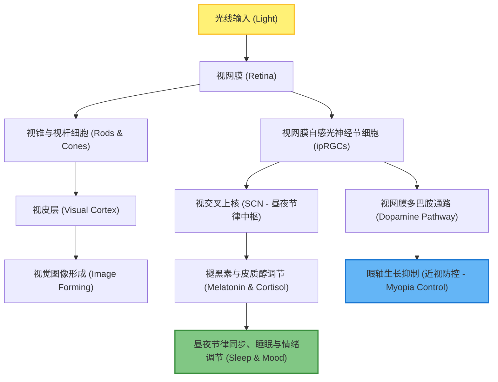

# 前沿研究报告：长期室内光照对身心健康的影响及光谱补偿科学意义

随着现代生活方式的演变，人们平均有 **80%～90%** 的时间在室内度过。长期处于传统的、缺乏光谱调谐的室内人工照明环境中，对人体的生理和心理健康产生了深远且往往被忽视的影响。

本报告系统梳理了关于室内光照健康影响的前沿科学研究，并结合本项目“基于机器学习的自然光光谱预测与多通道 LED 补偿系统”探讨其应用价值与优化方向。

---

## 一、 核心生理机制：非视觉生物效应 (Non-Image-Forming, NIF)

传统照明设计仅关注由视锥细胞和视杆细胞介导的“视觉效应”（如亮度和显色）。然而，近二十年来的神经科学研究发现，光还通过以下路径直接调控人体的非视觉功能：

*   **ipRGCs 细胞与视黑素 (Melanopsin)**：视网膜中存在一种特殊的感光细胞——视网膜自感光神经节细胞 (ipRGCs)。这类细胞表达视黑素，其光谱敏感曲线在 **460nm～490nm**（蓝-青光波段）达到峰值。
*   **生物钟的“对时”**：ipRGCs 细胞不参与图像成像，而是通过视网膜下丘脑束直接投影到**视交叉上核 (SCN)**。SCN 是人体的“主生物钟”，通过控制褪黑素（Melatonin，促进睡眠）和皮质醇（Cortisol，促进清醒）的释放，维持人体的昼夜节律。

---

## 二、 长期处于传统室内光照的主要身心健康影响

> [!WARNING]
> 传统室内人工照明（如荧光灯、单色 LED）具有**光谱断裂、亮度不足、缺乏动态演变**等致命缺陷。长期处于这种环境中会对身心产生全方位的负面影响。

### 1. 昼夜节律失调与睡眠障碍 (Circadian Disruption)
*   **白天“光饥饿”，晚上“光污染”**：室外自然光照度通常在 10,000 至 100,000 lux，而室内照明一般仅有 100 至 500 lux。白天长期在昏暗的室内工作，ipRGCs 无法得到足够的蓝光刺激，导致生物钟“对时”失败。
*   **夜间褪黑素抑制**：夜间长时间暴露于富含蓝光的屏幕或冷白光照明下，会强烈抑制褪黑素的分泌，导致入睡困难、深睡眠缩短及睡眠质量下降，长期可诱发慢性失眠和免疫力下降。

### 2. 青少年近视风险升高 (Myopia Progression)
*   **多巴胺分泌不足**：流行病学研究证实，户外活动时间是预防近视最有效的单一保护因子。在户外高强度自然光（>10,000 lux）刺激下，视网膜会释放**多巴胺 (Dopamine)**，多巴胺能有效抑制眼轴的异常变长（眼轴变长是近视的本质病理改变）。
*   **室内弱光诱发近视**：室内照明不仅照度极低，而且缺乏室外自然光中特定的红光和蓝光波段组合，无法维持足够的视网膜多巴胺分泌，导致眼轴加速拉长，直接增加了青少年的近视发病率。

### 3. 情绪障碍与心理健康 (Mood Disorders)
*   **季节性情绪失调 (SAD)**：缺乏自然光照射与抑郁症（尤其是季节性情绪失调）有显著的因果关系。光照缺乏会改变大脑中血清素（Serotonin，快乐荷尔蒙）的代谢，导致人出现情绪低落、焦虑、疲惫和社交退缩。
*   **压力激素水平上升**：在长期单调、冷冰冰的人工光照下工作，人体的压力激素（皮质醇）分泌曲线会平坦化，导致日间压力无法有效释放，加剧慢性疲劳。

### 4. 认知效率与注意力下降 (Cognitive Decline)
*   ipRGCs 激活后，会投射到大脑的脑干网状结构和前脑，激活警觉脑区。白天缺乏高 Melanopic（等效视黑素）刺激的光照，会导致人持续处于“亚清醒”状态，表现为注意力分散、工作记忆力下降、决策失误率上升。

---

## 三、 自然光 vs 传统人工光源的科学对比

| 物理/生物特性 | 天然日照 (Natural Daylight) | 传统暖白/冷白 LED (Conventional LED) | 长期室内暴露的健康影响 |
| :--- | :--- | :--- | :--- |
| **光谱连续性** | 全波段连续，无断裂，完美黑体辐射/天光光谱 | 蓝光波段极高（有蓝光危害风险），绿红光波段凹陷 | 引起视觉疲劳，色彩还原度低，非视觉刺激失衡 |
| **照度水平** | 极高 (10,000 ~ 120,000 lux) | 偏低 (100 ~ 500 lux) | 导致视网膜多巴胺释放不足，促进眼轴拉长（近视） |
| **动态演变** | 随时间、天气、太阳高度角进行色温和照度的动态微调 | 恒定不变（静态） | 导致人体主生物钟（SCN）无法对时，生物钟漂移 |
| **视黑素刺激值 (Melanopic Value)** | 高（白天气水分充足，有效维持警觉度） | 低（常规室内光难以激活足够的 ipRGC 效应） | 长期低刺激导致日间嗜睡、精神不振、抑郁 |

---

## 四、 本课程设计项目的科学意义与应用前景

本项目实现的**“基于天气对齐的自然光光谱预测”与“七通道 LED 光谱补偿”**，恰好针对性地解决了上述室内光健康危机。

> [!TIP]
> **本项目的核心价值在于**：
> 通过算法，以极低的环境感知成本（无需昂贵的光谱仪，仅通过免费天气 API 和经纬度时间），在室内动态、高保真地还原自然光的**光谱分布形状**，为“人因健康照明 (Human-Centric Lighting, HCL)”提供了闭环的算法方案。

### 1. 模拟昼夜节律调谐（基于 CCT 与光谱重构）
在 `lighting_compensation.py` 中，针对不同场景设计了不同的目标光谱：
*   **“学习/办公”模式**：主动调高了 **470nm 附近（蓝-青光波段）**的光谱权重。这正好能够高效激活 ipRGCs 细胞，促进日间皮质醇分泌，提升注意力和警觉度。
*   **“休息”模式**：主动削减了 **450nm 附近的蓝光波段**，增加 **630nm 附近的红光波段**。这能够极大降低对褪黑素的抑制，帮助在睡前平稳降低心率和交感神经兴奋性，促进健康睡眠。

### 2. 精准光谱补偿（避免传统白光 LED 的缺点）
传统的双色温 LED 调光仅能改变宏观的色温和亮度，其光谱分布依然存在严重的“蓝光尖峰”和“青光凹陷”（即所谓的 Cyan Gap，约 480nm 处）。
本项目使用的 **七通道混光 LED 系统（深蓝、青光、绿光、琥珀光、红光、暖白、冷白）**，能通过非负最小二乘法（NNLS）优化，精准地填补这些光谱漏洞，使室内光线的能量分布无限逼近真实的太阳光，降低视觉疲劳。

---

## 五、 对本项目的技术优化与下一步升级建议

为进一步突出本课程设计的学术水平和实用价值，建议在现有代码体系中引入前沿健康照明评价标准：

### 1. 引入 CIE S 026 黑素等效照度 (Melanopic EDI) 指标
*   **背景**：国际照明委员会 (CIE) 于 2018 年发布了 **CIE S 026 标准**，正式使用“等效光子黑素勒克斯 (Melanopic EDI)”来量化光对人生物钟的刺激强度。
*   **优化方案**：在 `lighting_compensation.py` 中，定义 ipRGC 细胞的光谱响应权重向量 $s_{mel}(\lambda)$（其峰值在 490nm）。对预测的光谱和补偿后的光谱进行乘积积分，计算出 `Melanopic Lux` 或 `M/P ratio`（黑素刺激比）。
*   **公式**：
    $$Melanopic\ Stimulus = \sum_{\lambda=380}^{780} S(\lambda) \cdot s_{mel}(\lambda) \cdot \Delta\lambda$$

### 2. 动态调节“目标光谱”的动态场景机制
*   目前项目的 `scene_target_spectrum` 仅根据 `scene` 静态配置（“休息”/“学习”/“办公”）。
*   **优化方案**：建议将**当前时间 (Cwd Time / Local Hour)** 引入目标光谱的生成逻辑。
    *   **上午 8:00 - 11:00**：设定为高色温、高蓝光刺激的目标光谱，模拟旭日东升，激活大脑。
    *   **中午 11:00 - 13:00**：设定为超高亮度、高照度目标，模拟正午阳光，助力多巴胺分泌（近视预防）。
    *   **晚上 19:00 以后**：无论用户处于什么“场景”，系统都应强制或建议平滑过渡到低蓝光、高暖红光的“日落”光谱，保护视网膜与睡眠。

### 3. 在 Streamlit Web 界面增加“健康照明评估看板”
*   在 `app.py` 界面上展示：
    *   **“生物钟激活度 (Circadian Activation Index)”**：展示当前混合光谱对 ipRGC 的激活百分比。
    *   **“近视防控多巴胺指数 (Dopamine Support Index)”**：基于照度与红/蓝波段比例，评估当前室内光对防近视的贡献。
    *   **“显色指数 (CRI) 评估”**：评估多通道 LED 补偿后，色彩还原度的提升。

---

## 六、 主要参考文献及数据来源 (References & Data Sources)

本研究报告基于以下权威学术期刊、国际标准组织及公共健康数据库的研究成果进行汇总：

### 1. 核心神经生物学与昼夜节律研究
*   **Berson, D. M., Dunn, F. A., & Takao, M. (2002).** *Phototransduction by retinal ganglion cells that set the circadian clock.* **Science**, 295(5557), 1070-1073.
    *   *贡献*：首次在哺乳动物视网膜中发现并证实了第三类感光细胞 ipRGCs 及其含有的视黑素（Melanopsin），奠定了现代健康照明与非视觉生物效应的理论基础。
*   **Lucas, R. J., Peirson, S. N., Berson, D. M., Brown, T. M., Cooper, H. M., Czeisler, C. A., ... & Brainard, G. C. (2014).** *Measuring and using light in the melanopic era.* **Trends in Neurosciences**, 37(1), 1-9.
    *   *贡献*：明确了在评估非视觉效应时应使用视黑素等效刺激量（Melanopic quantities）而非视觉照度，推动了后续国际标准的制定。
*   **Blume, C., Garbazza, C., & Spitschan, M. (2019).** *Effects of light on human circadian physiology, sleep and mood.* **Somnologie**, 23(3), 147-156.
    *   *贡献*：综述了不同波长、强度、持续时间和时间的室内光照对褪黑素抑制、昼夜节律同步、睡眠及情绪的量化影响。

### 2. 国际标准与学术规范
*   **CIE S 026/E:2018.** *System for Metrology of Optical Radiation for ipRGC-Influenced Responses to Light.* **International Commission on Illumination (CIE)**.
    *   *贡献*：定义了五种感光细胞的相对光谱灵敏度函数，并正式确立了等效视黑素勒克斯（Melanopic EDI）的国际计量标准。

### 3. 光照强度、光谱与近视防控研究
*   **Rose, K. A., Morgan, I. G., Ip, J., Kifley, A., Huynh, S., Smith, W., & Mitchell, P. (2008).** *Outdoor activity reduces the prevalence of myopia in children.* **Ophthalmology**, 115(8), 1279-1285.
    *   *贡献*：通过大规模流行病学调查，确立了户外高照度自然光照射与降低青少年近视率之间的强相关性。
*   **Ashby, R. S., & Schaeffel, F. (2010).** *The effect of bright light on development in chick myopia.* **Investigative Ophthalmology & Visual Science**, 51(10), 5247-5253.
    *   *贡献*：通过动物模型实验揭示了高强度光照刺激视网膜多巴胺释放、进而通过多巴胺通路控制眼轴过度增长的生物机制。
*   **Jiang, X., Kurihara, T., Kunimi, H., Miyauchi, M., Ikeda, S. I., Mori, K., ... & Tsubota, K. (2021).** *Violet light suppresses lens-induced myopia in chicks.* **Scientific Reports**, 11(1), 1-11.
    *   *贡献*：发现了自然光中的短波紫外-紫光波段（约 360-400nm）在室内人工光源中的缺失，同样是导致眼部发育异常及近视高发的重要原因之一。

### 4. 智能照明与光谱补偿应用研究
*   **Houser, K. W., & Esposito, T. (2021).** *Human-centric lighting: science, policy, and practice.* **Lighting Research & Technology**, 53(5), 373-393.
    *   *贡献*：探讨了如何利用多通道混光 LED 系统（HCL）进行光谱工程（Spectral Engineering）设计，以恢复室内光线的生物相似性。
