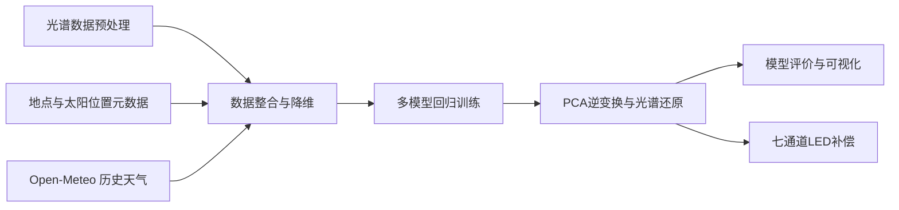

<center>
<br><br><br><br><br>
<h1 style="font-size: 2.2em;">自然光相对光谱预测与室内照明补偿</h1>
<br>
<h2>Python 应用开发基础课程报告</h2>
<br><br><br><br><br><br><br><br><br>
<h5>小组成员：李安逸、黄奕滔</h5>
<h5>任课教师：雷杰</h5>
<h5>日　　期：2026 年 6 月 日</h5>
<br><br><br>
</center>

#### 项目摘要

自然光的光谱分布直接影响人的昼夜节律和视觉健康，基于光谱的动态室内照明可能成为未来趋势。但专业光谱仪价格高昂，普通家庭、教室和办公室难以长期配置。另一方面，天气预报系统可以提供温度、湿度、云量等气象信息，却并不输出完整的天光光谱数据。我们想做的事也就很清楚：利用公开实测天光光谱数据，结合历史天气 API 和太阳位置元数据，用机器学习方法推断自然光光谱形态，并给出室内 LED 照明补偿建议。

关键词：机器学习；PCA 降维；随机森林回归；多输出回归；Python 数据处理；健康照明

<div style="page-break-after: always;"></div>

## 目录

1. [课题背景与问题提出](#一课题背景与问题提出)
   - 1.1 长期室内环境与照明质量
2. [设计目标与总体流程](#二设计目标与总体流程)
   - 2.1 设计目标
   - 2.2 总体流程
3. [数据来源与数据集构成](#三数据来源与数据集构成)
4. [数据处理与质量分析](#四数据处理与质量分析)
   - 光谱数据清洗与波长重采样
   - 元数据与天气数据对齐
   - 特征构造
5. [机器学习建模方法](#五机器学习建模方法)
   - 5.1 多输出回归问题定义
   - 5.2 特征预处理
   - 5.3 PCA 降维
6. [模型训练、调整与选择](#六模型训练调整与选择)
   - 6.1 候选模型对比
   - 6.2 随机森林模型设计
   - 6.3 训练流程
7. [模型评价与结果分析](#七模型评价与结果分析)
   - 7.1 评价指标
   - 7.2 模型对比结果
   - 7.3 光谱预测曲线对比
   - 7.4 特征重要性分析
8. [模型输出与系统展示](#八模型输出与系统展示)
9. [室内照明补偿算法与应用延伸](#九室内照明补偿算法与应用延伸)
   - 七通道 LED 光谱补偿
   - 与传统双色温混光对比
10. [回顾](#十回顾)
11. [不足与改进方向](#十一不足与改进方向)
12. [小组分工](#十二小组分工)
13. [总结](#十四总结)
14. [脚注与参考资料](#脚注与参考资料)

<div style="page-break-after: always;"></div>
## 一、课题背景与问题提出

### 1.1 长期室内环境与照明质量

学生、办公室职员和居家人群每天待在室内的时间越来越长，人们在室内的时间基本上超过室外，光照问题也就不再只是"看得清"这么简单。已有研究指出，光照通过视网膜中的非成像感光通路影响昼夜节律、睡眠和情绪状态[^berson][^blume]；户外自然光暴露与青少年近视风险降低之间的关联，也积累了相当数量的证据[^rose]。自然光的优势不仅在于照度更高，还在于它具有连续自然光谱和随时间变化的特点——这两种特性是目前大多数室内人工光源不具备的。

传统照明设计通常关注照度、色温和显色指数（Ra）三个指标。照度回答"亮不亮"，色温大致区分"偏冷还是偏暖"，显色指数评价色彩还原能力。其中 Ra 取 8 个低饱和度标准色样在被测光源与参考光源下的色差平均值，能粗略反映"颜色会不会严重失真"，但对高饱和度颜色不敏感，也无法捕捉光谱形状的细微差异，不能区分光源是否让物体看起来自然真实。也就是说，这三个指标都不能完整描述光本身。两种光源即使照度、色温和显色指数接近，光谱分布也可能相差甚远。对希望改善学习、办公或休息环境的智能照明系统来说，只调节亮度和色温显然不够，继续关注光谱分布才有意义。

问题是，如果想准确获知当前的自然光光谱，直接方法是配置光谱仪实时采集。专业光谱仪价格较高，普通家庭、教室或办公室很难仅为照明控制而长期购置。另一方面，天气预报系统虽然提供温度、湿度、云量、降水等气象信息，却并不直接输出完整的当地太阳光或天光光谱数据。

于是我们提出一个核心问题：能否利用较容易获得的天气、时间、太阳高度角和室外照度等信息，用机器学习模型推断自然光的光谱形态，并把这个预测结果用于室内照明补偿？这个想法的实际意义在于降低光谱级照明调节对昂贵硬件的依赖——即使没有专业光谱仪，家庭或单位也可以用廉价的照度传感器、色温传感器或低精度色彩传感器，结合天气数据和模型预测，辅助判断室内光谱状态；若以后硬件和数据条件更成熟，它也可以成为高质量室内照明普及的一种技术准备。

需要说明的是，我们这次做的不是医学实验，也不是真实灯具的控制系统，而是一个以 Python 机器学习为核心的课程设计原型。我们解决的问题可以概括为三点：如何把真实天光光谱数据整理成可训练的数据集；如何用合适的机器学习方法预测高维连续光谱；如何把预测结果转化为室内 LED 补偿建议。

## 二、设计目标与总体流程

### 2.1 设计目标

我们希望从真实公开天光光谱数据出发，用 Python 完成数据下载、清洗、合并、插值和特征构造，以 PCA 降维处理高维光谱标签，对比多种机器学习回归模型并选择效果较好的方案，再用 MAE、RMSE、R² 和光谱曲线对比评价效果，最后将模型输出用于七通道 LED 光谱补偿计算，并用 Notebook、图表和 Streamlit 页面展示结果。

### 2.2 总体流程



这个流程的前半部分是数据工程，后半部分是机器学习建模，最后落到一个目的明确的应用场景。

## 三、数据来源与数据集构成

#### 天光光谱数据

我们主要使用 SKYSPECTRA 公开实测天光光谱数据集，其中 `spectral_horizontal_irradiance.csv` 是光谱数据来源，`meta_location.csv`、`meta_weather.csv`、`meta_sun_positions.csv` 等文件提供地点、时间、太阳位置和室外照度信息。我们最终采用 380nm 至 780nm 的可见光范围，每 10nm 采样一次，形成 41 维光谱向量。原始数据并非直接以所需格式提供，数据处理因此成为我们工作中很重要的一部分。

#### 历史天气数据

为了让模型能够从环境条件预测光谱，我们使用 Open-Meteo 历史天气 API 补充气象特征，包括云量、相对湿度、温度和降水量。代码根据观测地点经纬度和日期范围批量查询天气数据，并将小时级天气记录与光谱测量时间对齐。

#### LED 光谱数据

在照明补偿部分，我们使用公开实测 LED 光谱数据构造暖白和冷白通道，并与深蓝、青光、绿光、琥珀光、红光通道组合成七通道 LED 模型。LED 数据不参与自然光光谱预测模型的训练，仅用于后续补偿计算。

#### 最终数据集构成

最终数据集为 `data/real_spectrum_weather_dataset.csv`，基本情况如下：

| 项目 | 数值 |
| --- | --- |
| 样本量 | 5664 条 |
| 字段数 | 62 列 |
| 光谱维度 | 41 维 |
| 波长范围 | 380nm-780nm |
| 采样间隔 | 10nm |
| 时间范围 | 2016-03-16 至 2018-07-28 |
| 主要建模特征 | 时间、云量、湿度、温度、降水、太阳高度角、室外照度、天气类别 |

## 四、数据处理与质量分析

#### 光谱数据清洗

原始光谱数据是长表格式，一条测量记录对应多个波长点。为了让机器学习模型能够使用，需要先删除无效值，再把长表转成宽表。核心处理位于 `src/real_data_pipeline.py`。

关键步骤如下：

```python
df = pd.read_csv(file_path)
df = df.dropna(subset=["spectral_horizontal_irradiance", "wavelength"])
df = df[df["spectral_horizontal_irradiance"] >= 0]

pivoted = df.pivot(
    index=["location_code", "timestamp"],
    columns="wavelength",
    values="spectral_horizontal_irradiance"
)
pivoted = pivoted.dropna(how="all")
```

这段代码把"地点、时间、波长、光谱值"整理成"每一行代表一个时间地点样本，每一列代表一个波长"的矩阵形式，后续的 PCA 和回归模型才能直接读取光谱矩阵。

#### 波长重采样

不同来源的光谱数据，波长点可能不完全符合课程展示和建模需要。我们统一采用 380nm 至 780nm、每 10nm 一个采样点的范围，既保留可见光的主要变化，又避免维度过高。

核心代码如下：

```python
resampled_row = np.interp(WAVELENGTHS, original_wls, cleaned_row)
```

`numpy.interp` 进行线性插值后，每条光谱有 41 个数值，列名从 `wavelength_380` 到 `wavelength_780`。这一处理让所有样本维度统一，是后续 PCA 降维和模型训练的基础。

#### 元数据与天气数据对齐

光谱数据本身只给出测量结果，预测还需要当时的环境条件。我们把光谱数据与太阳位置、室外照度和历史天气数据合并。

核心思路如下：

```python
merged = pd.merge(
    meta,
    spectra_df,
    left_on=["location_code", "timestamp"],
    right_index=True,
    how="inner"
)

merged["datetime_local"] = pd.to_datetime(merged["timestamp"].str.slice(0, 16))
merged["nearest_hour"] = merged["datetime_local"].dt.round("H")
```

光谱测量时间通常不是整点，而 Open-Meteo 提供的是小时级天气数据，代码中将测量时间对齐到最近小时后再合并天气特征。这个处理虽然简单，但对课程设计比较实用，能够把真实测量数据和公开天气数据接到同一张训练表中。

#### 特征构造

模型最终使用的输入特征包括：

| 特征 | 含义 |
| --- | --- |
| `hour` | 测量小时 |
| `cloud_cover` | 云量 |
| `humidity` | 相对湿度 |
| `temperature` | 温度 |
| `precipitation` | 降水量 |
| `solar_altitude` | 太阳高度角 |
| `outdoor_lux` | 室外水平照度 |
| `weather` | 天气类别 |

其中天气类别使用独热编码，其余数值特征做标准化。这些特征与自然光变化有较直接的关系，也方便解释模型结果。

#### 数据量与质量分析

数据处理完成后需要检查数据基本情况，包括样本量、特征分布、缺失值、天气类别分布和光谱曲线形态。当前数据集中没有缺失值，光谱维度统一为 41 维。以下图表可以辅助说明：不同天气和不同时段下，自然光的强度和光谱形态确实会发生变化，因此使用环境特征预测光谱具有合理性。


## 五、机器学习建模方法

### 5.1 从光谱预测到多输出回归

我们面对的机器学习问题可以写成：

$$
f(x) \rightarrow S(\lambda)
$$

其中 $x$ 表示天气、时间、太阳高度角和室外照度等环境特征，$S(\lambda)$ 表示 380nm 至 780nm 范围内的光谱曲线。这个问题的难点在于光谱是高维连续数据，不适合做简单分类——同一种天气下，不同时刻、不同太阳高度角和不同照度也会产生连续变化；只预测一个色温或一个亮度又会丢失大量波长细节。因此我们将它归类为多输出回归问题。

### 5.2 特征预处理

代码中使用 `ColumnTransformer` 同时处理数值和类别特征：

```python
return ColumnTransformer(
    transformers=[
        ("num", StandardScaler(), NUMERIC_FEATURES),
        ("cat", make_one_hot_encoder(), CATEGORICAL_FEATURES),
    ],
    remainder="drop",
)
```

数值特征尺度不同，温度、照度、云量的范围差别很大，需要标准化；天气类别不能直接以文字输入模型，用独热编码转换为数值特征。这样处理后，不同模型可以在同一套特征上公平比较。

### 5.3 PCA 降维

原始光谱标签有 41 维。如果直接让模型预测 41 个波长点，训练会更复杂，也更容易受到相邻波长相关性的干扰。实际上，光谱曲线相邻波长之间变化较平滑，存在明显相关性。PCA 可以把 41 维光谱压缩成少量主成分，用较少变量表示主要变化。

设原始光谱矩阵为 $X$，PCA 投影矩阵为 $W$，降维后的主成分系数为 $Z$：

$$
Z = XW
$$

模型预测的不是原始光谱，而是主成分系数：

$$
\hat{Z} = f(x)
$$

最后通过 PCA 逆变换还原光谱：

$$
\hat{X} = \hat{Z}W^T
$$

代码中的实现如下：

```python
target_scaler = StandardScaler()
y_scaled = target_scaler.fit_transform(y)

pca = PCA(n_components=n_components, random_state=random_state)
y_pca = pca.fit_transform(y_scaled)
```

我们保留 5 个主成分，累计解释方差约为 99.9976%，少量主成分已经能表示光谱的主要变化。


## 六、模型训练、调整与选择

### 6.1 候选模型

我们对比了四类回归模型：

| 模型 | 在课题中的作用 |
| --- | --- |
| Linear Regression | 作为线性基准模型，观察简单线性关系能达到的效果 |
| KNN Regression | 利用相似环境样本进行预测，适合作为直观对照 |
| Decision Tree | 能处理非线性关系，结构相对容易解释 |
| Random Forest | 多棵决策树集成，稳定性较好，是最终选择的模型 |


### 6.2 随机森林模型设计

随机森林由多棵决策树组成。每棵树训练时只看到一部分样本和一部分特征，最后综合多棵树的结果。对于回归任务，可以理解为：

$$
\hat{y} = \frac{1}{T} \sum_{t=1}^{T} h_t(x)
$$

其中 $T$ 是树的数量，$h_t(x)$ 是第 $t$ 棵树的预测结果。

我们选择随机森林作为最终模型，主要考虑三点：自然光光谱与环境因素之间不是简单线性关系，随机森林能处理非线性特征组合；相比单棵决策树，随机森林通过集成减少偶然误差，稳定性更好；随机森林可以输出特征重要性，便于分析模型主要依赖哪些环境因素。

代码中随机森林的主要参数如下：

```python
RandomForestRegressor(
    n_estimators=180,
    max_depth=18,
    min_samples_leaf=2,
    random_state=random_state,
    n_jobs=-1,
)
```

`n_estimators=180` 表示使用 180 棵树；`max_depth=18` 限制树深度，避免模型过于复杂；`min_samples_leaf=2` 要求叶子节点保留一定样本，减少过拟合；`n_jobs=-1` 使用多核并行，提高训练效率。

### 6.3 训练流程

训练流程可以概括为：读取环境特征和光谱标签，对光谱标签做标准化，用 PCA 得到主成分系数，划分训练集和测试集，训练不同回归模型预测 PCA 系数，再用 PCA 逆变换还原预测光谱，最后统一评价。

关键代码如下：

```python
pipeline = Pipeline(
    steps=[
        ("preprocess", build_preprocessor()),
        ("model", model),
    ]
)
pipeline.fit(x_train, y_train_pca)
y_pred_pca = pipeline.predict(x_test)
y_pred = inverse_transform_spectrum(target_scaler, pca, y_pred_pca)
```

`Pipeline` 把特征预处理和模型训练连在一起，流程清楚，也能避免训练集和测试集处理方式不一致。

## 七、模型评价与结果分析

### 7.1 评价指标

我们使用 MAE、RMSE 和 R² 评价模型。

平均绝对误差：

$$
MAE = \frac{1}{n} \sum_{i=1}^{n} |y_i - \hat{y}_i|
$$

均方根误差：

$$
RMSE = \sqrt{\frac{1}{n} \sum_{i=1}^{n} (y_i - \hat{y}_i)^2}
$$

决定系数：

$$
R^2 = 1 - \frac{\sum_{i=1}^{n} (y_i - \hat{y}_i)^2}{\sum_{i=1}^{n} (y_i - \bar{y})^2}
$$

MAE 和 RMSE 越小越好，R² 越接近 1 表示模型解释能力越强。对光谱预测来说，只看一个指标不够，我们同时用曲线图观察真实光谱和预测光谱是否贴合。

### 7.2 模型对比结果

当前模型评价结果如下：

| 模型 | MAE | RMSE | R² |
| --- | ---: | ---: | ---: |
| Random Forest | 0.002795 | 0.005759 | 0.999727 |
| KNN Regression | 0.003044 | 0.007621 | 0.999547 |
| Decision Tree | 0.003291 | 0.011678 | 0.998800 |
| Linear Regression | 0.037130 | 0.045748 | 0.984109 |

随机森林在 MAE、RMSE 和 R² 上都表现最好，因此作为最终模型。KNN 和决策树也取得了较好效果，说明数据中环境特征与光谱变化之间存在可学习的规律。线性回归相对较弱，说明该问题不是简单线性映射。


### 7.3 最终模型光谱预测曲线对比

在确定随机森林后，我们单独绘制最终模型的真实值与预测值对比。曲线对比更能说明模型是否学到了光谱整体形状：


### 7.4 特征重要性与光谱尺度分析

在随机森林训练结果中，室外照度的特征重要性高达 **96.5%**。

这一结果需要谨慎解读：从物理本质上看，光谱的相对形状（如色温）仍由太阳高度角、云量和温湿度决定，照度之所以在特征重要性中占支配地位，是因为模型预测目标是绝对光谱辐照度，而室外照度在自然界中存在数万倍的剧烈跨度，主导了回归误差与 PCA 第一主成分。我们在训练时有意保留了光谱的绝对量级，是为了让模型输出最贴近真实观测的绝对光谱，具备直接进行绝对光谱强度仿真的能力。

下游应用的核心逻辑在于，室内照明补偿算法实际运行时，核心输入是"光谱形态"而非"光照度"。照度在算法中仅用于简单缩放以评估自然光占比，混光补偿计算 LED 权重时首先会将预测光谱归一化，剔除亮度干扰，提取反映光色品质的光谱相对形状。补偿算法的核心任务是填补波段缺陷以匹配目标光谱形状。若后续仅需模型专注于形状预测，可在训练前对光谱做行归一化，届时太阳高度角和天气等特征的重要性会显著提升。


需要说明的是，特征重要性只能反映当前数据和当前模型中的影响程度，不能直接等同于真实物理因果关系，报告中使用它主要是为了帮助理解模型的判断依据。

## 八、模型输出与系统展示

### Notebook 展示内容

Notebook 主要用于展示完整实验流程，包括数据读取与基本信息展示、光谱数据可视化、PCA 解释方差、多模型训练与评价、预测光谱与真实光谱对比、LED 补偿计算结果。

图片占位：


### Streamlit 页面展示内容

Streamlit 页面用于把训练好的模型和结果做成可交互展示。正式报告中建议放以下截图：数据预览页面展示样本字段、天气与照度数据；光谱分析页面展示不同天气或不同条件下的光谱曲线；PCA 与模型页面展示 PCA 解释方差和模型评价指标；输出比对页面展示原始真实光谱与模型预测光谱；预测与补偿页面展示输入环境参数后的预测光谱和 LED 补偿比例。

图片占位：


## 九、室内照明补偿算法与应用延伸

#### 从预测光谱到补偿建议

模型预测出当前自然光光谱后，我们进一步计算室内 LED 补偿比例。基本思路是：根据使用场景确定目标光谱，估计当前自然光在室内的贡献，计算还缺少哪些波段，再由七通道 LED 进行补充。

学习、阅读、办公和休息场景的目标不同。学习和办公可以适当提高蓝-青光波段，增强白天清醒感；休息场景则降低蓝光、增加暖色波段，减少对夜间睡眠节律的干扰。这种处理与健康照明方向有关，但这里仍只做算法演示，不能当作严谨的医学结论。

#### 七通道 LED 光谱补偿

设七通道 LED 的光谱矩阵为：

$$
A = [S_1(\lambda), S_2(\lambda), ..., S_7(\lambda)]
$$

设 LED 通道权重为：

$$
w = [w_1, w_2, ..., w_7]^T, \quad w_i \ge 0
$$

目标是让 LED 补偿光谱尽量接近目标光谱与当前自然光贡献之差：

$$
\min_{w \ge 0} \|Aw - (S_{target} - S_{current})\|_2^2
$$

这个公式对应代码中的非负最小二乘思想，解决"多个 LED 通道分别开多少才能尽量接近目标光谱"的问题。相比人工凭经验调节，算法计算更稳定；相比传统双色温调节，七通道补偿能在更多波段上进行控制。

#### 补偿结果展示


### 9.4 与传统双色温混光对比

下图中加入了传统双色温混光作为对照，用于直观观察不同混光方案的差异：


需要注意，这张图只能作为辅助展示。显示器本身是 RGB 发光原理，图中光色还经过色彩坐标转换，与真实照明环境中的光谱感受会有偏差，报告中更可靠的判断仍应以光谱曲线和 RMSE 误差为主。

## 十、回顾

我们从真实数据出发，完成了数据清洗、时间对齐、特征构造、PCA 降维、多模型训练、评价和可视化。对 Python 课程设计来说，这比只展示单个模型结果更扎实，也更接近一次机器学习项目本来的样子。

光谱数据维度较高，且波长之间有明显相关性。PCA 降维在这里不是摆一个算法名词，它实际解决的是模型直接预测高维连续光谱时训练困难、解释困难的问题。

我们没有停留在"预测光谱曲线"这一步，而是继续将预测结果用于 LED 补偿计算，说明机器学习模型输出如何服务实际应用。健康照明和以人为本照明已经是照明研究中的重要方向[^houser]，未来基于光谱的照明很可能成为智能照明的重要趋势。这个课程设计只是一个小型原型，离工程应用尚远，但这个方向值得继续做下去。


## 十一、不足与改进方向

这个课题虽然使用了真实公开光谱数据，但仍存在限制：公开免费的中国地区天光光谱数据较难获取，当前可用建模数据缺少中国有效样本；数据地点分布不够均衡，影响模型对更多地区的泛化能力和适用性；历史天气 API 与现场光谱测量并非同一设备同步采集，存在时间和空间上的偏差；光谱仪价格较高，我们没有接入真实光谱仪进行本地验证；LED 补偿部分仍是算法演示，没有连接真实多通道灯具硬件；当前目标光谱设计比较简单，尚未引入更完整的健康照明评价指标。也没有更多个性化要求下的光谱调整算法。

后续可以从以下方向继续完善：寻找或采集中国地区真实天光光谱数据；在室内加入廉价照度传感器、色温传感器或低精度色彩传感器，辅助模型判断当前光环境；将天气 API、室内传感器和机器学习模型结合，减少对专业光谱仪的依赖；接入真实智能灯具，验证七通道补偿在实际空间中的效果；做跨地点测试，评估模型在不同城市、不同气候环境下的泛化能力；也可以加入 Melanopic EDI 等健康照明指标[^cie]，不过本课程设计暂不展开。

## 十二、小组分工

李安逸：负责数据收集与处理、数据调整、可视化调整、课程报告撰稿与编写。
黄奕滔：负责数据处理、代码实现、可视化实现、课程报告检查和补充。
共同完成：主题讨论、文献查阅、幻灯片制作、答辩准备、结果检查和最终材料整理。

大模型使用情况：我们在以下环节使用了大模型辅助：数据源收集和汇总，专业知识调查和分析；报告结构整理和辅助编写；代码注释与编写辅助；可视化表达相关代码编写辅助。项目核心思想、计划和整体方案由我们队员讨论完成。模型和结果全部由 Python 代码根据项目中的机器学习算法生成。

## 十四、总结

我们以真实天光光谱数据为基础，把数据处理、机器学习预测和室内照明补偿连在了一起。实现上，主要使用 Python 完成数据清洗、插值、时间对齐、PCA 降维和多模型回归对比，最终选择随机森林作为预测模型。实验结果表明，它在当前数据集上取得了较好的效果，能够较准确地还原测试样本中的光谱曲线。

在实现过程中，我们也对 Python 和机器学习有了更实际的理解。拿到数据只是第一步，后面的字段合并、时间对齐和质量检查，才真正决定数据能不能拿来训练；PCA 放在光谱预测里，也就不再只是课本里的降维概念，把 41 维连续光谱压缩成更容易学习的主成分，对模型训练的优化至关重要；随机森林同样如此，它靠多棵决策树综合判断环境特征和光谱变化之间的非线性关系。模型效果当然要看指标，但只看一个好看的数值是不够的，预测曲线、误差大小、特征重要性和应用场景，都要放在一起综合判断。

这个课题也让我们看到机器学习可贵的地方。效果和分数固然重要，但现实问题还会追问另外几件事：数据能不能获得，硬件成本能不能降下来，结果能不能转化为可实施的建议。专业光谱仪价格较高，但天气数据、照度传感器、色温或低精度色彩传感器相对容易获得；倘若模型能够把这些普通信息转化为光谱级判断，更细致的室内照明调节也就有可能走出实验室，进入家庭、教室和办公室。作为课程设计，它还不能等同于成熟系统，但我们愿意把它称为一次“温室外的探索”：我们没有只在理想数据和固定题目里训练模型，而是试着把 Python、机器学习和真实生活问题连接起来。我们相信，这样的探索是有价值的。

<div style="page-break-after: always;"></div>

## 脚注与参考资料

[^skyspectra]: SKYSPECTRA 数据集：Zenodo, *SKYSPECTRA: an opensource data package for worldwide spectral daylight*, record 8147546, https://zenodo.org/records/8147546。

[^openmeteo]: Open-Meteo Historical Weather API 文档：https://open-meteo.com/en/docs/historical-weather-api。

[^berson]: Berson, D. M., Dunn, F. A., & Takao, M. (2002). *Phototransduction by retinal ganglion cells that set the circadian clock*. Science, 295(5557), 1070-1073.

[^blume]: Blume, C., Garbazza, C., & Spitschan, M. (2019). *Effects of light on human circadian physiology, sleep and mood*. Somnologie, 23, 147-156.

[^cie]: CIE S 026/E:2018, *System for Metrology of Optical Radiation for ipRGC-Influenced Responses to Light*, International Commission on Illumination.

[^rose]: Rose, K. A., Morgan, I. G., Ip, J., Kifley, A., Huynh, S., Smith, W., & Mitchell, P. (2008). *Outdoor activity reduces the prevalence of myopia in children*. Ophthalmology, 115(8), 1279-1285.

[^houser]: Houser, K. W., & Esposito, T. (2021). *Human-centric lighting: science, policy, and practice*. Lighting Research & Technology, 53(5), 373-389.
