<center>
<br><br><br><br><br>
<h1 style="font-size: 2.2em;">自然光相对光谱预测与室内照明补偿</h1>
<br>
<h2>Python 应用开发基础课程报告</h2>
<br><br><br><br><br><br><br><br><br>
<h5>小组成员：李安逸、黄奕滔</h5>
<h5>任课教师：          雷杰</h5>
<h5>日　　期：2026 年 6 月 17 日</h5>
<br><br><br>
</center>

#### 项目摘要

自然光的光谱分布直接影响人的昼夜节律和视觉健康，基于光谱的动态室内照明可能成为未来趋势。但专业光谱仪成本高昂，普通家庭、教室和办公室难以长期配置。另一方面，天气预报系统可以提供温度、湿度、云量等气象信息，却并不输出完整的天光光谱数据。一条可行的思路是利用公开实测天光光谱数据，结合按地点和时间对齐的历史天气特征与太阳位置元数据，用机器学习模型估计自然光相对光谱，并把预测结果用于室内 LED 照明补偿设计。

关键词：机器学习；PCA 降维；多输出回归；GridSearchCV 参数调优；Python 数据处理；健康照明

<div style="page-break-after: always;"></div>

## 目录

1. [课题背景与意义](#%E4%B8%80%E8%AF%BE%E9%A2%98%E8%83%8C%E6%99%AF%E4%B8%8E%E6%84%8F%E4%B9%89)
2. [设计目标](#%E4%BA%8C%E8%AE%BE%E8%AE%A1%E7%9B%AE%E6%A0%87)
3. [数据来源与数据说明](#%E4%B8%89%E6%95%B0%E6%8D%AE%E6%9D%A5%E6%BA%90%E4%B8%8E%E6%95%B0%E6%8D%AE%E8%AF%B4%E6%98%8E)
4. [系统总体流程](#%E5%9B%9B%E7%B3%BB%E7%BB%9F%E6%80%BB%E4%BD%93%E6%B5%81%E7%A8%8B)
5. [数据处理与特征工程](#%E4%BA%94%E6%95%B0%E6%8D%AE%E5%A4%84%E7%90%86%E4%B8%8E%E7%89%B9%E5%BE%81%E5%B7%A5%E7%A8%8B)
6. [PCA 光谱降维](#%E5%85%ADpca-%E5%85%89%E8%B0%B1%E9%99%8D%E7%BB%B4)
7. [模型训练与模型对比](#%E4%B8%83%E6%A8%A1%E5%9E%8B%E8%AE%AD%E7%BB%83%E4%B8%8E%E6%A8%A1%E5%9E%8B%E5%AF%B9%E6%AF%94)
8. [最优模型选择与结果分析](#%E5%85%AB%E6%9C%80%E4%BC%98%E6%A8%A1%E5%9E%8B%E9%80%89%E6%8B%A9%E4%B8%8E%E7%BB%93%E6%9E%9C%E5%88%86%E6%9E%90)
9. [模型参数调优](#%E4%B9%9D%E6%A8%A1%E5%9E%8B%E5%8F%82%E6%95%B0%E8%B0%83%E4%BC%98)
10. [室内照明补偿算法](#%E5%8D%81%E5%AE%A4%E5%86%85%E7%85%A7%E6%98%8E%E8%A1%A5%E5%81%BF%E7%AE%97%E6%B3%95)
11. [应用展示](#%E5%8D%81%E4%B8%80%E5%BA%94%E7%94%A8%E5%B1%95%E7%A4%BA)
12. [方案对比与项目特色](#%E5%8D%81%E4%BA%8C%E6%96%B9%E6%A1%88%E5%AF%B9%E6%AF%94%E4%B8%8E%E9%A1%B9%E7%9B%AE%E7%89%B9%E8%89%B2)
13. [实现过程中的困难与解决](#%E5%8D%81%E4%B8%89%E5%AE%9E%E7%8E%B0%E8%BF%87%E7%A8%8B%E4%B8%AD%E7%9A%84%E5%9B%B0%E9%9A%BE%E4%B8%8E%E8%A7%A3%E5%86%B3)
14. [不足与改进方向](#%E5%8D%81%E5%9B%9B%E4%B8%8D%E8%B6%B3%E4%B8%8E%E6%94%B9%E8%BF%9B%E6%96%B9%E5%90%91)
15. [小组分工](#%E5%8D%81%E4%BA%94%E5%B0%8F%E7%BB%84%E5%88%86%E5%B7%A5)
16. [总结](#%E5%8D%81%E5%85%AD%E6%80%BB%E7%BB%93)
17. [脚注与参考资料](#%E8%84%9A%E6%B3%A8%E4%B8%8E%E5%8F%82%E8%80%83%E8%B5%84%E6%96%99)

## 一、课题背景与意义

学生、办公室职员和居家人群每天待在室内的时间越来越长，光照问题也就不再只是"看得清"这么简单。已有研究指出，光照通过视网膜中的非成像感光通路影响昼夜节律、睡眠和情绪状态[1](#user-content-fn-berson)[2](#user-content-fn-blume)；户外自然光暴露与青少年近视风险降低之间的关联，也积累了相当数量的证据[3](#user-content-fn-rose)。自然光的优势不仅在于照度更高，还在于它具有连续光谱和随时间变化的节律友好特点，这两种特性是目前大多数室内人工光源不具备的。

传统照明设计通常关注照度、色温和显色指数（Ra）三个指标。照度回答"亮不亮"，色温大致区分"偏冷还是偏暖"，显色指数评价色彩还原能力。其中 Ra 取 8 个低饱和度标准色样在被测光源与参考光源下的色差平均值，能粗略反映"颜色会不会严重失真"，但对高饱和度颜色不敏感，也无法捕捉光谱形状的细微差异。两种光源即使照度、色温和显色指数都接近，光谱分布也可能相差甚远。当前多数室内照明仍主要停留在亮度和色温层面，很多场景甚至只满足"够亮"，光谱层面的照明设计还没有广泛进入日常应用。

如果想准确获知当前的自然光光谱，直接办法是配置光谱仪实时采集。专业光谱仪价格较高，普通家庭、教室或办公室很难仅为照明控制而长期购置。天气预报系统虽然提供温度、湿度、云量、降水等气象信息，却并不直接输出当地的天光光谱。

本课题的核心问题在于：能否利用较容易获得的天气、时间、地点、太阳位置和室外照度等信息，通过机器学习估计自然光的相对光谱形态，并将估计结果用于室内照明补偿？本项目利用真实公开天光光谱数据和上述环境特征，训练模型估计自然光相对光谱，探索其在室内照明补偿中的应用可能，作为面向高质量照明的一次前瞻性课程实验。

## 二、设计目标

围绕上述问题，项目设定了五个具体目标：

1. 用 Python 代码完成真实公开天光光谱数据的下载、清洗、合并、插值和天气对齐，产出一份可训练的数据集；
2. 用 PCA 把高维光谱标签压缩为少量主成分，解决直接预测 41 维连续光谱的训练与解释困难；
3. 在相同特征、相同目标、相同数据划分下对比五种 sklearn 回归模型，用统一指标选出最佳模型；
4. 把模型预测的主成分系数经 PCA 逆变换还原为 380nm～780nm 的相对光谱曲线，检验还原效果；
5. 把预测光谱接入七通道 LED 补偿算法，输出通道比例和补偿前后误差。

## 三、数据来源与数据说明

#### 天光光谱数据

我们主要使用 SKYSPECTRA 公开实测天光光谱数据集[4](#user-content-fn-skyspectra)，其中 `spectral_horizontal_irradiance.csv` 提供光谱测量值（约 78MB 的长表），`meta_location.csv`、`meta_weather.csv`、`meta_sun_positions.csv` 等文件提供地点坐标、时间、天空状况、太阳位置和室外照度。原始数据并非直接以建模所需的格式提供，数据整理因此成为我们工作中很重要的一部分。

数据集中实际能与光谱测量匹配上的观测站有两个，分别位于法国沃昂夫兰（Vaulx-en-Velin，里昂附近，5636 条样本）和新加坡（28 条样本）。站点名称和坐标直接取自数据集元数据，代码中没有人工指定坐标；如果某个站点编号在元数据中找不到坐标，流水线会直接报错而非默认猜测。

#### 历史天气数据

为了让模型能从环境条件估计光谱，我们用 Open-Meteo 历史天气 API[5](#user-content-fn-openmeteo) 补充云量、相对湿度、温度和降水量。代码按观测站经纬度和日期范围批量查询，并把小时级天气记录对齐到光谱测量的最近整点。需要说明边界：这些天气数据是按地点和时间对齐的历史天气特征，不是与光谱测量同设备、同步采集的现场气象数据，与测量瞬间的真实天气可能存在差异。

#### LED 光谱数据

照明补偿部分使用公开实测 LED 光谱数据[6](#user-content-fn-ledspd)构造暖白、冷白通道，并与深蓝、青光、绿光、琥珀光、红光通道组成七通道 LED 模型。LED 数据不参与光谱估计模型的训练，只用于补偿计算。

#### 标准观察者色匹配函数

应用展示要把不同光谱换算成屏幕上的近似颜色，这一步需要标准观察者色匹配函数。我们没有用 1931 年的 CIE 标准观察者，它距今已近百年，且容易让演示停留在传统色度学层面；改用 CIE 170-2:2015 的 XYZ 色匹配函数（由 CIE 2006 Stockman-Sharpe 生理学锥细胞数据推导，10° 视场），数据来自 UCL 颜色与视觉研究实验室（CVRL）公开 CSV[7](#user-content-fn-cvrl)。

#### 最终数据集构成

最终数据集为 `data/real_spectrum_weather_dataset.csv`，基本情况如下：

| 项目      | 数值                                            |
| ------- | --------------------------------------------- |
| 样本量     | 5664 条                                        |
| 字段数     | 58 列                                          |
| 光谱维度    | 41 维（`wavelength_380` ~ `wavelength_780`）     |
| 波长范围与间隔 | 380nm～780nm，每 10nm 一点                         |
| 时间范围    | 2016-03-16 至 2018-07-28                       |
| 观测站     | 法国沃昂夫兰（5636 条）、新加坡（28 条）                      |
| 环境特征    | 时间、月份、太阳高度角与方位角、云量、湿度、温度、降水、室外照度、天气类别、天空状况、站点 |

## 四、系统总体流程

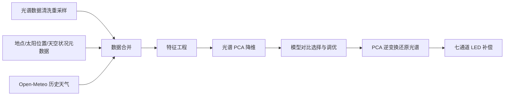

**模型输入**——天气、时间、地点、太阳位置、室外照度等低成本环境特征；

**模型输出**——光谱的 5 个 PCA 主成分系数，经 PCA 逆变换还原为 41 维相对光谱曲线；

**应用输出**——预测光谱与目标光谱对比，计算补偿差值，输出七个 LED 通道的比例、补偿前后误差变化，并与传统双色温 LED 方案对照。

## 五、数据处理与特征工程

#### 光谱数据清洗与重采样

原始光谱是长表格式，一条测量记录对应一个波长点。建模需要先删除缺失值和负值，再把长表透视成"每行一个时间地点样本、每列一个波长"的宽表，最后过滤全 0 光谱。核心处理位于 `src/real_data_pipeline.py`：

```python
df = df.dropna(subset=["spectral_horizontal_irradiance", "wavelength"])
df = df[df["spectral_horizontal_irradiance"] >= 0]

pivoted = df.pivot(
    index=["location_code", "timestamp"],
    columns="wavelength",
    values="spectral_horizontal_irradiance",
)
pivoted = pivoted.dropna(how="all")
```

不同来源的光谱波长点并不统一，我们用 `numpy.interp` 线性插值，把所有光谱重采样到 380nm～780nm、每 10nm 一点的网格上，得到 41 维光谱向量。维度统一之后，PCA 和回归模型才能直接读取光谱矩阵。

#### 元数据与天气对齐

光谱本身只给出测量结果，估计还需要当时的环境条件。我们先按"站点编号 + 时间戳"合并太阳位置和天空状况元数据，再把测量时间对齐到最近整点、按"站点 + 整点小时"合并 Open-Meteo 天气：

```python
merged["nearest_hour"] = merged["datetime_local"].dt.round("h")
final_df = pd.merge(
    merged, all_weather,
    left_on=["location_code", "nearest_hour"],
    right_on=["location_code", "time"],
    how="inner",
)
```

光谱测量是 10 分钟级、天气是小时级，这一对齐方式虽然粗略但有效，能够将真实测量数据与公开天气数据合并到同一张训练表中。

#### 特征工程

模型最终使用 12 个原始特征字段：

| 类型   | 特征                                                     | 说明           |
| ---- | ------------------------------------------------------ | ------------ |
| 时间   | `hour`、`month`                                         | 测量小时、月份      |
| 太阳位置 | `solar_altitude`、`solar_azimuth`                       | 太阳高度角、方位角    |
| 天气   | `cloud_cover`、`humidity`、`temperature`、`precipitation` | 云量、湿度、温度、降水  |
| 观测辅助 | `outdoor_lux`                                          | 室外水平照度       |
| 类别   | `weather`、`sky_condition`、`location_code`              | 天气类别、天空状况、站点 |

预处理统一放进 sklearn 的 `ColumnTransformer`：数值特征做标准化（KNN、MLP 和线性模型对特征尺度敏感），三个类别特征做独热编码。`Pipeline` 把预处理和模型连在一起，保证训练集和测试集的处理方式完全一致：

```python
ColumnTransformer(
    transformers=[
        ("num", StandardScaler(), NUMERIC_FEATURES),
        ("cat", make_one_hot_encoder(), CATEGORICAL_FEATURES),
    ],
    remainder="drop",
)
```

#### 相对光谱归一化

目标侧同样需要处理。每条实测光谱按自身最大值归一化到 0～1，模型预测的是**相对光谱**（光的成分构成），而非绝对辐照强度——照度高低由 `outdoor_lux` 等特征单独表达。这样处理有两个理由：一是下游照明补偿算法关心的是光谱形状而非绝对强度；二是室外照度跨越数万倍量级，如果直接预测绝对光谱，强度差异会淹没形状差异，模型评价也会失真。

#### 数据观察

清洗后的数据集没有缺失值，天气类别分布为晴 3156、雨 1657、阴 514、多云 337。下面两张图说明环境条件确实会改变光照情况——不同天气下平均相对光谱形态不同，一天中室外照度随时间有明显的钟形变化——用环境特征估计光谱因此具有合理性。

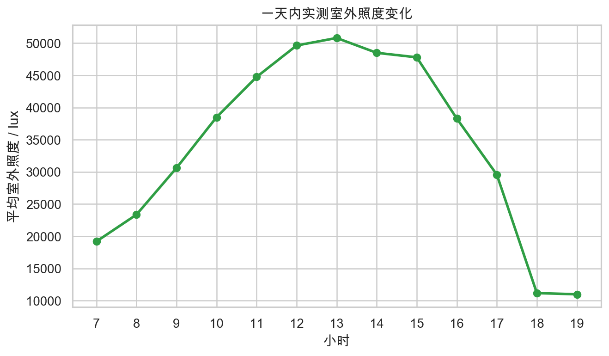

## 六、PCA 光谱降维

我们面对的机器学习问题可以写成

$$
f(x) \rightarrow S(\lambda)
$$

其中 $x$ 是环境特征，$S(\lambda)$ 是 41 维相对光谱。光谱相邻波长之间变化平滑、相关性强，直接让模型输出 41 个值，既增加训练负担，也难以解释。PCA 把 41 维光谱压缩成少量主成分，对光谱矩阵 $X$ 标准化后投影：

$$
Z = XW, \qquad \hat{Z} = f(x), \qquad \hat{X} = \hat{Z}W^{T}
$$

模型预测的是主成分系数 $\hat{Z}$，最后用 `inverse_transform` 还原光谱。代码实现封装在 `spectrum_pca.py`：

```python
scaled = self.scaler.fit_transform(spectra)
components = self.pca.fit_transform(scaled)
```

主成分数量不是预先定的。我们先用 10 个主成分观察解释方差：第 1 主成分解释 84.0%，前 5 个累计 98.3%，之后每个主成分的贡献都不足 1%。继续增加主成分对还原精度帮助很小，反而加大模型输出维度，正式实验因此保留 **5 个主成分**。

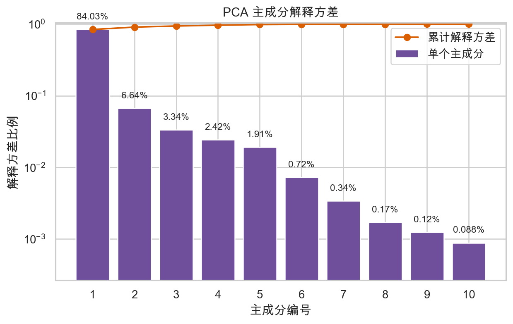

## 七、模型训练与模型对比

#### 候选模型

五个模型全部使用 sklearn 标准实现，在相同的训练集、相同特征、相同 PCA 目标下对比：

| 模型                      | 特点                  |
| ----------------------- | ------------------- |
| Linear Regression       | 线性基准，观察简单线性关系能达到的水平 |
| KNN Regressor           | 用相似环境样本做预测，直观对照     |
| Decision Tree Regressor | 处理非线性关系，结构容易解释      |
| Random Forest Regressor | 多棵决策树集成，稳定性好        |
| MLP Regressor           | 神经网络，检验非线性拟合能力      |

MLP 使用 `sklearn.neural_network.MLPRegressor`，参数设为 `hidden_layer_sizes=(128, 64)`、`max_iter=600`、`learning_rate_init=1e-3`，并开启 `early_stopping` 防止过拟合——MLP 对标准化、参数和数据规模都比较敏感，控制网络规模才能在课程环境下稳定收敛。随机森林参数后续调优决定，先用默认参数。本项目未将 CNN 纳入主实验：输入为表格型环境特征，CNN 更适合图像或序列数据，留待改进方向。

#### 训练流程

训练流程概括为：提取特征和相对光谱标签，PCA 得到主成分系数，按天气类别分层划分 80% 训练集和 20% 测试集，循环训练五个模型并记录每个模型的训练时间和预测时间，预测结果统一经 PCA 逆变换还原回光谱空间后评价。

```python
pipeline = Pipeline(steps=[("preprocess", build_preprocessor()), ("model", model)])
pipeline.fit(x_train, y_train_pca)
y_pred_pca = pipeline.predict(x_test)
y_pred = spectrum_pca.inverse_transform(y_pred_pca)
```

#### 评价指标

统一使用五项指标。平均绝对误差、均方根误差和决定系数衡量精度：

$$
MAE = \frac{1}{n} \sum_{i=1}^{n} |y_i - \hat{y}_i|,\qquad
RMSE = \sqrt{\frac{1}{n} \sum_{i=1}^{n} (y_i - \hat{y}_i)^2},\qquad
R^2 = 1 - \frac{\sum_i (y_i - \hat{y}_i)^2}{\sum_i (y_i - \bar{y})^2}
$$

训练时间和预测时间衡量成本。MAE、RMSE 越小越好，R² 越接近 1 越好；光谱预测只看单个指标不够，我们同时用曲线图检查预测光谱和实测光谱是否贴合。

## 八、最优模型选择与结果分析

#### 模型对比结果

测试集上的评估结果如下（按 RMSE 升序）：

| 模型                | MAE     | RMSE    | R²     | 训练时间/s | 预测时间/s |
| ----------------- | ------- | ------- | ------ | ------ | ------ |
| Random Forest     | 0.00506 | 0.00863 | 0.9593 | 0.94   | 0.22   |
| KNN               | 0.00502 | 0.00899 | 0.9542 | 0.03   | 0.14   |
| MLP               | 0.00582 | 0.00948 | 0.9625 | 1.87   | 0.005  |
| Decision Tree     | 0.00537 | 0.01235 | 0.8702 | 0.03   | 0.004  |
| Linear Regression | 0.02255 | 0.03755 | 0.6353 | 0.03   | 0.007  |

耗时为单次运行实测值，不同机器和负载下会有浮动；精度指标在固定随机种子下可复现。

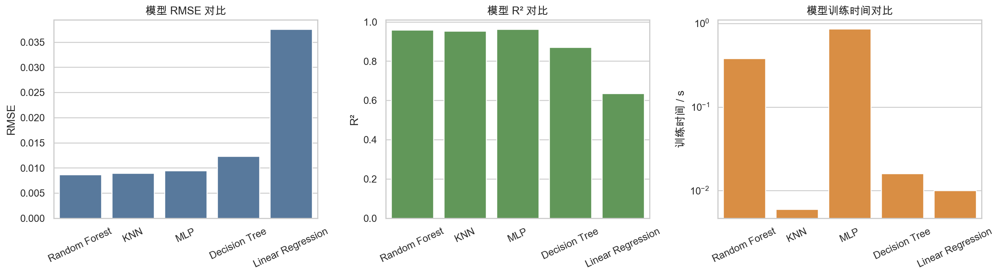

随机森林的 RMSE 最小，综合表现最好；KNN 的 MAE 略低于随机森林，说明邻近环境样本的光谱具有相似性，但它对个别偏差样本的 RMSE 更大，预测时还需逐样本检索邻居，耗时不低。MLP 的 R² 略高于随机森林，MAE 和 RMSE 却都更差——MLP 具备非线性拟合能力，但对标准化、参数设置和数据规模较敏感，在本项目数据条件下随机森林表现更稳定。单棵决策树明显落后于随机森林，体现了集成学习的价值。线性回归与其余模型差距很大，说明环境特征与光谱形状之间并非简单线性映射。

按 RMSE 最小原则，以及训练和预测时间优势，最终选择**随机森林**作为预测模型。

#### 光谱还原效果

确定最佳模型后，我们从测试集取样本检查还原效果。下图样本（晴天、16 时、太阳高度角 29.3°）的预测光谱与实测光谱基本重合，单样本 MAE 约 0.0015：


#### 特征重要性

随机森林可以输出特征重要性，帮助理解模型主要依赖哪些环境因素：室外照度约占 54%，其后是云量（8.6%）、太阳方位角（6.1%）、天气类别（5.7%）和太阳高度角（4.8%），均为影响光谱的显著因素。室外照度本身综合了太阳位置和天气的影响，其占比最高与物理直觉一致。需要说明，特征重要性反映的是当前数据和当前模型中的影响程度，不能直接等同于物理因果关系。


## 九、模型参数调优

#### 调优动机

第八节对比发现随机森林在五个模型中表现最优，但 `n_estimators=100, max_depth=20, min_samples_leaf=2` 只是一组经验参数。为进一步优化，本项目使用 `GridSearchCV` 对随机森林进行超参数调优。

#### 调参方法

调参策略包含两个层次：先在 PCA 空间做 5 折交叉验证，再对每组参数在全量训练集上拟合、测试集上预测，逆变换回光谱空间计算 MAE / RMSE / R²。综合 RMSE（主指标）和训练时间（效率指标）选出最优参数。

参数网格如下：

| 参数                  | 取值            | 说明          |
| ------------------- | ------------- | ----------- |
| `n_estimators`      | 100, 200, 300 | 决策树数量       |
| `max_depth`         | 10, 20, None  | 树的最大深度      |
| `min_samples_split` | 2, 5, 10      | 节点分裂所需最小样本数 |

共 3 × 3 × 3 = 27 组参数组合，每组完成 5 折交叉验证。实现代码位于 `src/hyperparameter_tuning.py`，核心逻辑为：

```python
grid = GridSearchCV(
    estimator=pipeline,
    param_grid=param_grid,
    cv=5,
    scoring="neg_root_mean_squared_error",
    n_jobs=-1,
    refit=True,
)
grid.fit(x_train, y_train_pca)
```

#### 各参数影响分析

从 27 组结果中可以看到：

- `n_estimators`**（树的数量）**：100 棵 RMSE=0.009017，200 棵 0.009031，300 棵 0.009053。树越多 RMSE 反而略升，说明 100 棵已经足够收敛，加树只增加训练时间（0.17s → 0.28s → 0.61s），没有实质收益。
- `max_depth`**（最大深度）**：深度 10 时 RMSE 普遍在 0.0092–0.0097，明显大于深度 20 或不限深度的组合，说明树太浅导致欠拟合；深度 20 与不限深度的 RMSE 差距在 0.0001 以内，几乎无差别。选 20 比不限深度训练更快且无精度损失。
- `min_samples_split`**（节点分裂最小样本数）**：取值 5 时 RMSE 最优（0.0090–0.0092），比默认值 2 略好——适当限制分裂可以抑制过拟合；取值 10 时 RMSE 上升到 0.0092–0.0094，说明限制过强会轻微抑制树的生长。

#### 最优参数与最终结果

综合 RMSE 最小和训练效率，最终选出的最优参数为 `n_estimators=100, max_depth=20, min_samples_split=5`。用该参数在全量训练集上训练最终模型，测试集评估结果如下：

| 指标   | 值      |
| ---- | ------ |
| MAE  | 0.0051 |
| RMSE | 0.0090 |
| R²   | 0.9513 |
| 训练时间 | 0.17s  |
| 预测时间 | 0.016s |

相比原始经验值（180, 18, 2），调优后的参数更精简（100 棵树、更深但有上限的树），精度略有提升且速度更快。

## 十、室内照明补偿算法

#### 从预测光谱到补偿建议

模型给出当前自然光的相对光谱后，补偿算法需要确定七个 LED 通道各自的权重。基本思路如下：以实测晴天高太阳高度角日光的平均光谱为目标光谱（由真实数据计算，非人工设定）；按室外照度估计自然光在室内的贡献比例；计算目标光谱与当前自然光贡献的差值；用非负最小二乘求解 LED 通道权重，使混光尽量拟合该差值。

设七通道 LED 光谱矩阵为 $A = [S_1(\lambda), \dots, S_7(\lambda)]$，通道权重 $w \ge 0$，优化目标为

$$
\min_{w \ge 0} \|Aw - (S_{target} - S_{current})\|_2^2
$$

这对应 `lighting_compensation.py` 中的投影梯度法实现。相比人工凭经验调灯，算法计算结果更稳定；相比传统双色温调节，七通道在更多波段上具备精细修正能力。LED 通道光谱全部来自公开实测 LED 数据。

#### 传统双色温 LED 对照

为了说明多通道补偿相对常见方案的优势，本项目另外实现了一个传统双色温 LED 基线。市面上常见的双色温灯具只有冷暖配比和亮度两个调节维度，其混光可表示为

$$
S_{dual}(\lambda) = g \cdot \left[ a \cdot S_{warm}(\lambda) + (1-a) \cdot S_{cool}(\lambda) \right]
$$

其中 $a \in [0,1]$ 为暖白占比，$g$ 为亮度系数。代码在 $a$ 上做网格搜索，每个 $a$ 下 $g$ 有最小二乘闭式解（截断到非负），最终取与目标光谱误差最小的组合。对照规则与多通道方案一致，均以"自然光 + LED 混光尽量接近目标光谱"为目标，保证两种方案在同一标准下比较。暖白、冷白光谱与七通道方案用的是同一份实测数据。

#### 补偿效果

以第八节的测试样本为例（学习场景、目标照度 500 lux、室外照度 50000 lux），补偿前后的光谱 RMSE 从 0.4863 降到 0.2690，误差下降 44.7%。分波段看，黄绿敏感区改善 87.4%，橙红暖色段改善 75.4%，短波蓝光和深红边缘改善有限——这两段处在七通道 LED 覆盖能力的边缘，是硬件光谱本身的限制。

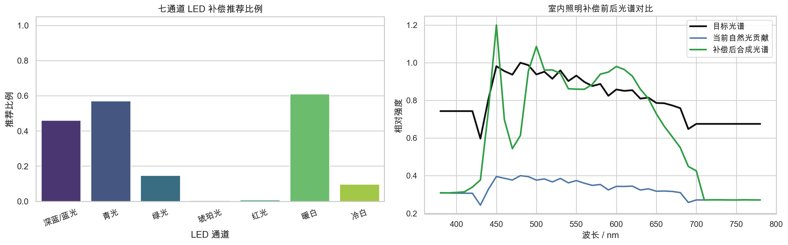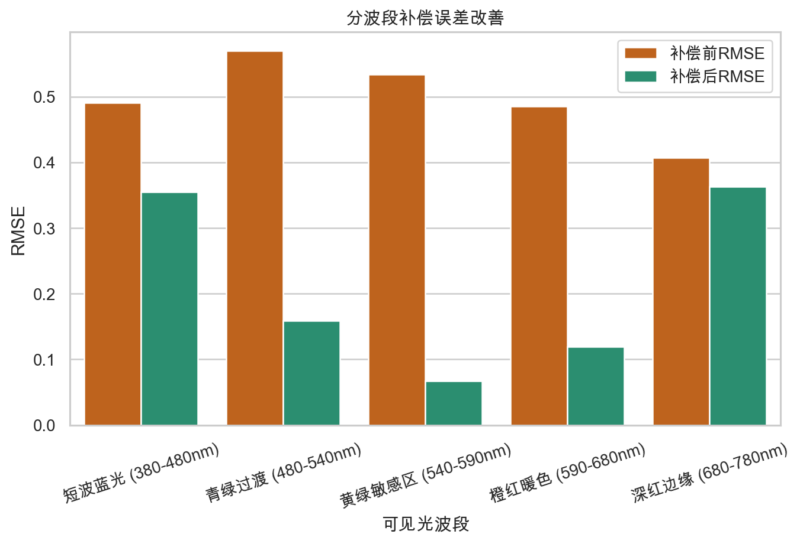

## 十一、应用展示

#### 应用环境演示

在应用展示部分，项目设置了晴天中午、多云下午、阴雨天气、傍晚低太阳高度角四类天气场景。每个场景的参数均来自真实数据：先在数据集中筛出对应场景的样本子集，数值特征取中位数、类别特征取众数，再覆盖少量场景标志值（如正午把小时定为 12），使生成的输入与训练数据保持同分布。系统根据场景参数预测自然光相对光谱，进一步计算多通道 LED 补偿方案，并用上一节的传统双色温 LED 方案作对照，比较两者与目标光谱之间的误差。四个场景都支持改为自定义参数。

四个预设的运行结果如下（由 `outputs/results/application_preset_summary.csv` 导出）：

| 天气预设     | 未补偿 RMSE | 多通道补偿 RMSE | 双色温对照 RMSE | 多通道误差下降 | 双色温暖白占比 |
| -------- | -------- | ---------- | ---------- | ------- | ------- |
| 晴天中午     | 0.3562   | 0.1989     | 0.2219     | 44.2%   | 43%     |
| 多云下午     | 0.6080   | 0.3342     | 0.3737     | 45.0%   | 45%     |
| 阴雨天气     | 0.7424   | 0.4126     | 0.4603     | 44.4%   | 44%     |
| 傍晚低太阳高度角 | 0.7500   | 0.4161     | 0.4640     | 44.5%   | 45%     |

两类方案在每个场景下均有稳定差距。从光谱曲线看原因更为直观：双色温方案在 460nm～540nm 青绿过渡段整体塌陷，仅靠暖白和冷白配比难以还原该段形状，多通道方案则通过青光、绿光通道弥补了这一缺口。

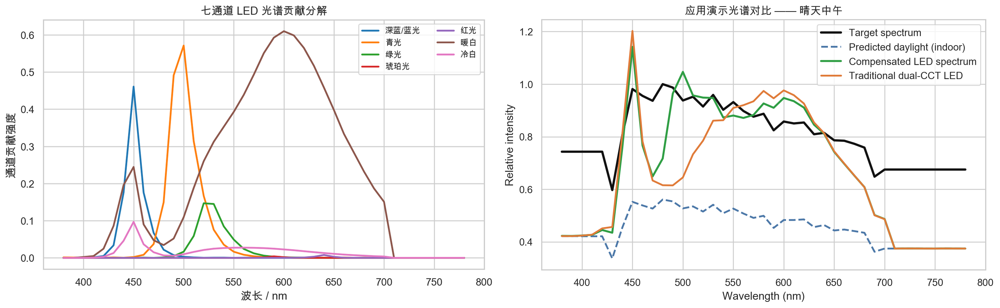

最后，系统把不同光谱通过 CIE 2015 标准观察者函数换算为屏幕 RGB，以圆形光斑形式展示其色度差异。几个圆统一大小、统一背景，亮度归一化后只比较色度。晴天中午场景下，多通道补偿后的光斑色度接近目标，双色温方案则明显偏暖粉。

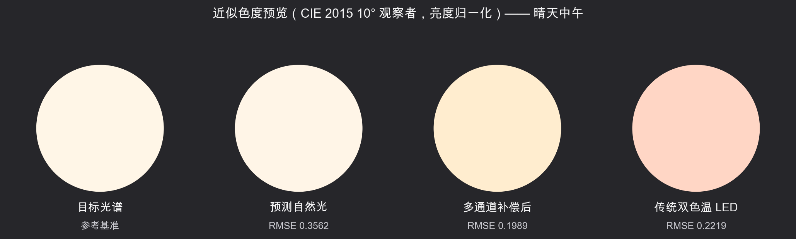

需注意，屏幕颜色仅为根据光谱计算得到的近似色度预览，不能替代真实光谱视觉效果。不同光谱可能在屏幕上显示为相近颜色，但其光谱组成仍然不同。

#### Notebook 演示

`main.ipynb` 按七个章节组织演示：数据来源与下载、数据观察与预处理、特征工程与光谱 PCA、模型训练（逐个打印五个模型的训练状态和耗时）、模型评估与最优模型选择、光谱预测与还原、照明补偿应用展示。第七节为上述应用环境演示的完整流程：选择天气预设、展示模型输入、输出 PCA 主成分系数和预测光谱、计算多通道补偿与双色温对照、绘制光谱对比和白圆色度对比、给出误差对比表。

演示截图：

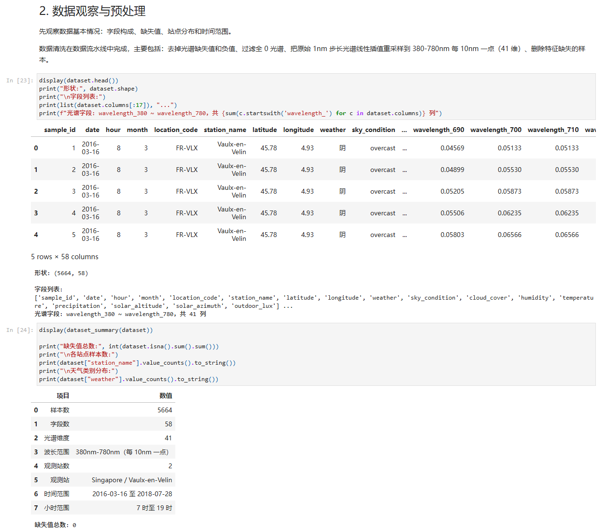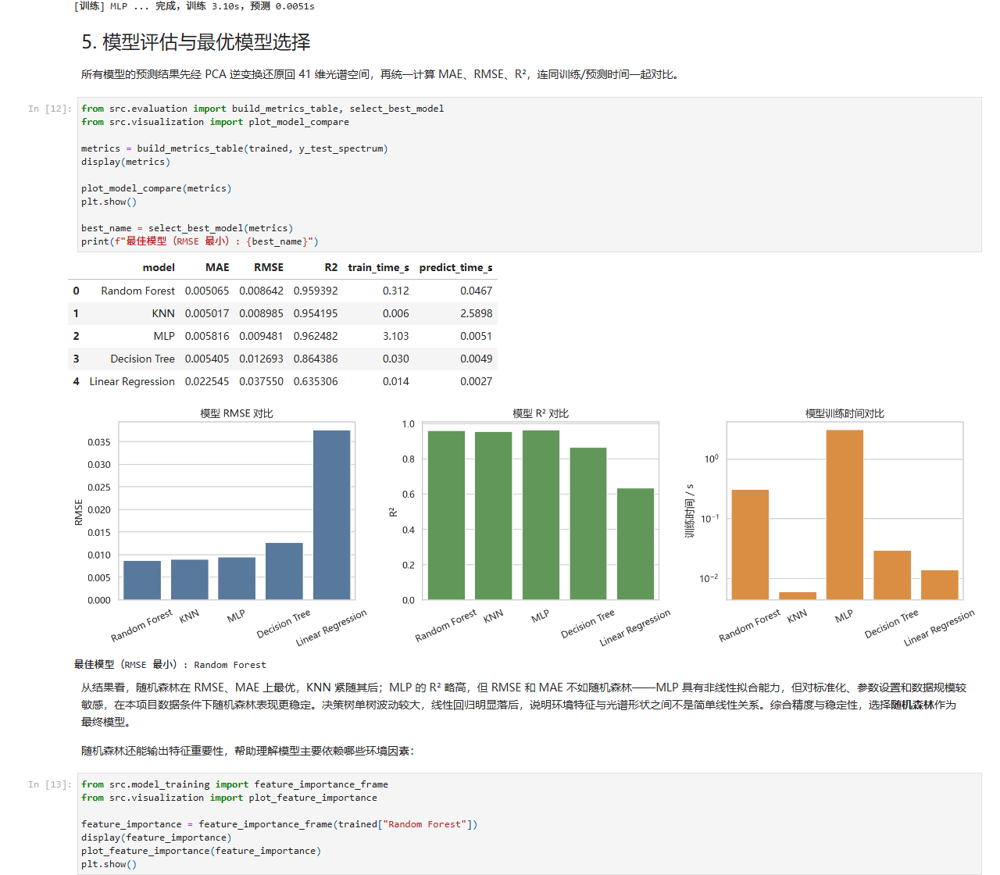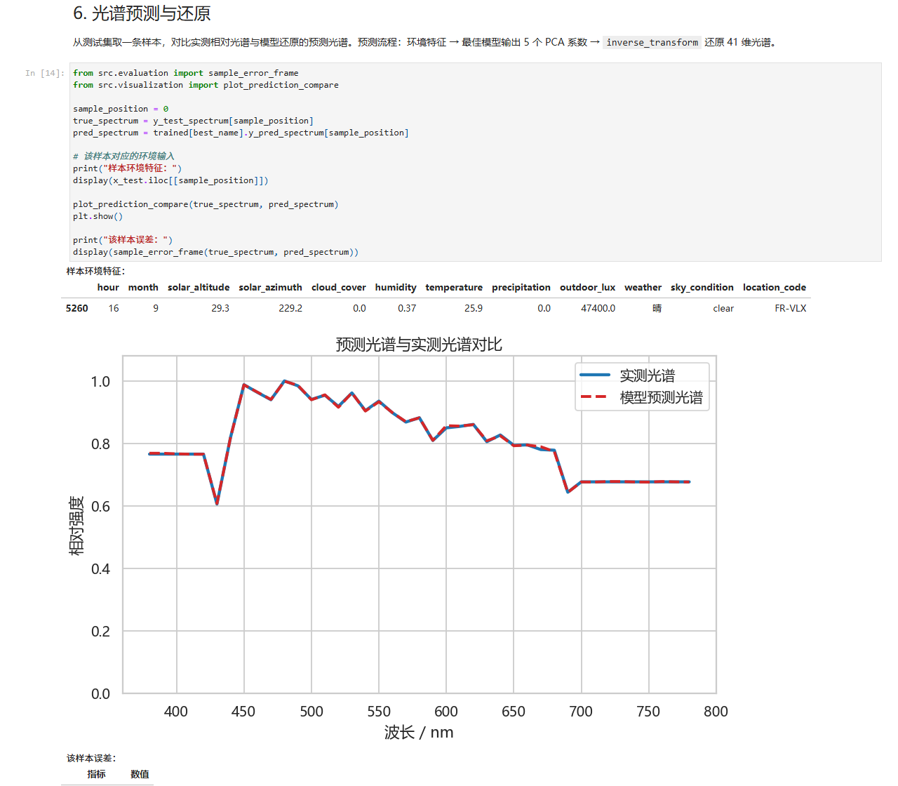

#### Streamlit 演示网页

`app.py` 是五个板块的课程演示看板，对应项目流程：数据概览（来源、样本数、站点、时间范围、数据预览）、光谱 PCA（解释方差图与主成分数量）、模型训练与对比（五模型指标表和对比图、最佳模型）、光谱预测结果（样本选择器与随机抽样按钮、实测与预测曲线、样本误差）、照明补偿应用演示。最后一个板块按"天气场景 → 光谱预测 → 照明补偿"组织：左侧选择天气预设或展开自定义参数，中间展示当前输入参数、PCA 主成分系数和多通道补偿比例，下方是四条光谱曲线对比、白圆色度对比和误差对比表。

演示截图：

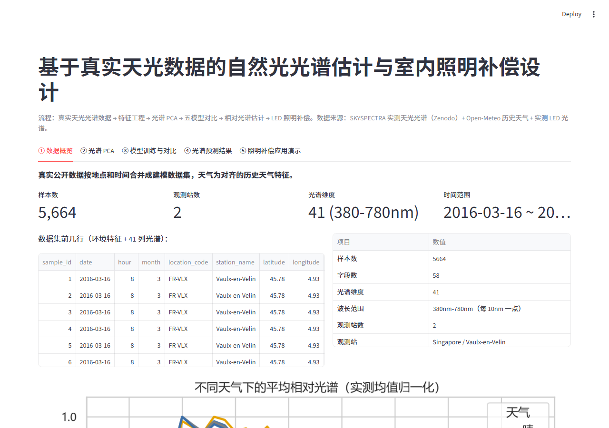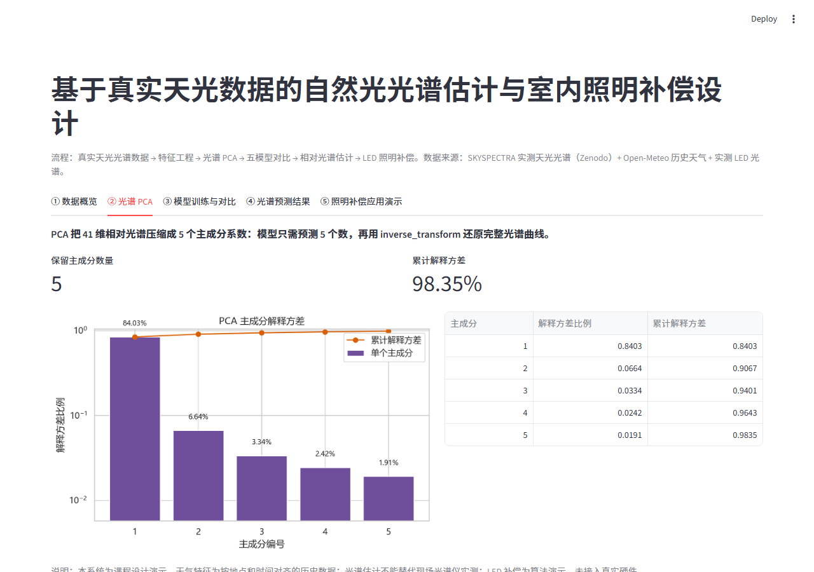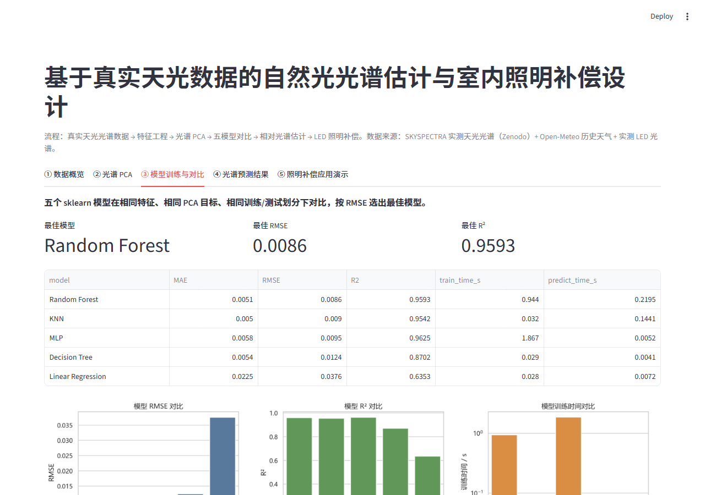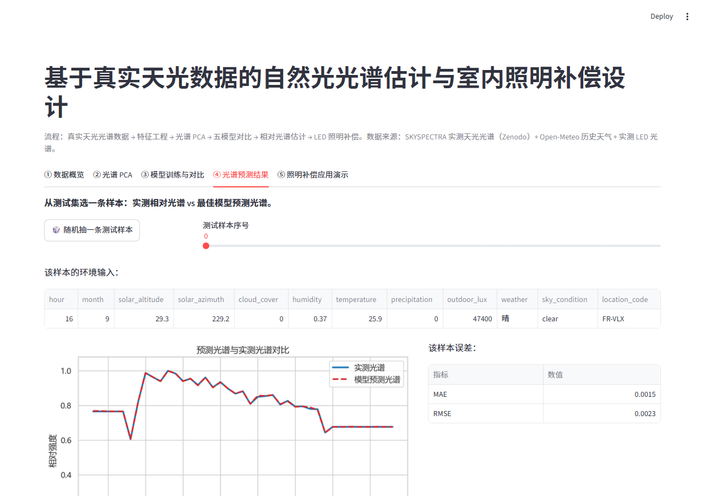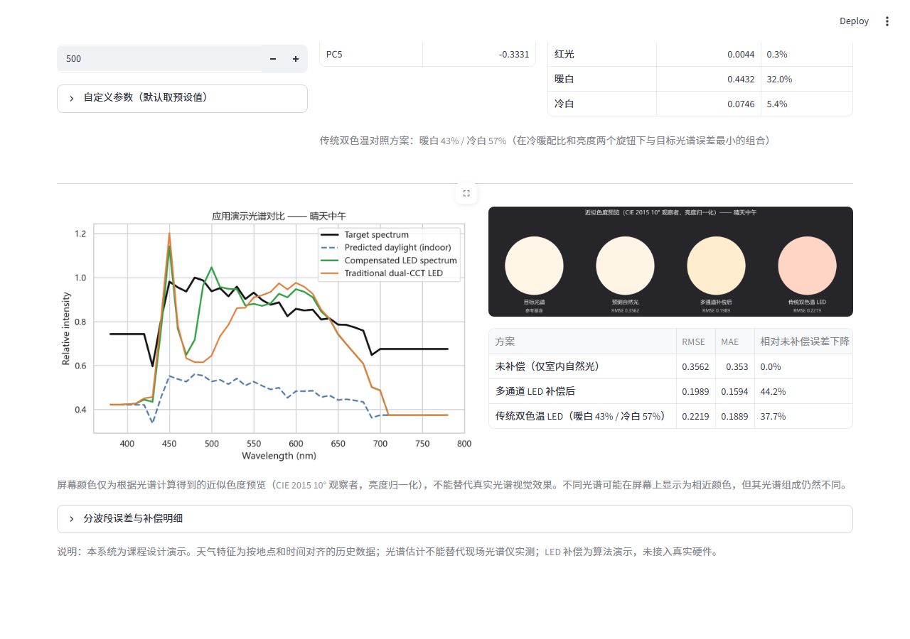

## 十二、方案对比与项目特色

#### 三种获取自然光光谱的方案

| 方案        | 优点                                        | 局限                             |
| --------- | ----------------------------------------- | ------------------------------ |
| 每个家庭部署光谱仪 | 本地实测，精度高                                  | 设备成本高，维护复杂，难以普及                |
| 区域光谱观测站   | 数据质量高，可像天气服务一样分发                          | 建设成本高，需要机构或城市级推动，目前尚未大规模落地     |
| 本项目方案     | 用公开真实数据训练模型，应用端只需天气、时间、地点、太阳位置等低成本特征，部署灵活 | 属于估计方案，不能等同于现场实测，也反映不了每个房间内部情况 |

本项目定位为一种介于昂贵实测与普通照明控制之间的轻量化光谱估计方案，旨在验证以低成本环境特征估计自然光光谱的可行性。

#### 项目特色

1. 真实公开光谱数据支撑——数据下载、清洗、合并全部由 Python 代码自动化完成；
2. 输入端低成本——应用时只需要天气、时间、地点、太阳位置等容易获得的特征；
3. PCA 降维表示高维光谱——41 维压缩到 5 个主成分，累计解释方差 98.3%；
4. 多模型真实对比——五个模型统一指标评价，结论由数据决定；
5. 系统化参数调优——GridSearchCV 交叉验证，27 组参数组合，兼顾精度和效率；
6. 预测结果进入照明补偿应用——从环境特征到 LED 通道比例和误差改善的完整链路。

## 十三、实现过程中的困难与解决

**真实数据文件多、字段关系复杂。** SKYSPECTRA 把光谱、地点、天气状况、太阳位置分散在多个文件里，时间戳带时区后缀，坐标写成 "45.78 N" 这样的字符串。逐个文件检查字段含义后，编写坐标解析和时间对齐函数，并在合并的每一步打印行数，确认样本未在某次合并中意外丢失。

**光谱维度高，直接预测难度大。** 41 维连续输出增加了训练负担，也不利于结果解释。引入 PCA 后模型只需预测 5 个系数，解释方差图为主成分数量的选择提供了依据。

**模型选择没有固定答案。** 不确定哪类模型适合这个问题，于是把五个模型放在完全相同的条件下对比，以统一指标作为评判依据，避免"先选模型再找理由"。

**MLP 调参不稳定。** 早期尝试中 MLP 多次不收敛或结果波动大。后来固定随机种子、开启早停、控制网络规模，训练才趋于稳定。模型复杂度不等于预测精度，最终它的 R² 略高但 RMSE 不如随机森林。

**绝对光谱与相对光谱的选择。** 最初模型直接预测绝对光谱，结果室外照度一个特征的重要性超过 90%，模型实际拟合的是亮度而非光谱形状。将目标改为按行归一化的相对光谱后，照度交给输入特征表达，特征重要性的分布趋于合理，与下游补偿算法的需求也更为匹配。

**照明补偿是简化算法。** 没有真实灯具可接，我们把范围简化到算法演示：用实测 LED 光谱数据做通道、用非负最小二乘求解。

## 十四、不足与改进方向

不足之处主要有五点。天气特征是按地点和时间对齐的历史数据，与光谱测量不一定完全同步；模型估计不能替代现场光谱仪实测；有效样本几乎全部来自法国一个站点（新加坡仅 28 条，国内缺失），跨地区泛化能力有限；未考虑真实房间的窗户朝向、反射、遮挡和灯具硬件差异；公开免费的中国地区天光光谱数据较难获取，当前数据集缺少中国样本。

后续可以从这些方向继续做：接入实时天气 API，让估计随当前天气更新；在室内加入廉价照度、色温或低精度色彩传感器辅助校正；接入真实多通道灯具验证补偿效果；寻找或采集更多地区（尤其是中国）的实测光谱数据，做跨地点测试；如果输入扩展到天空图像或时间序列，可以尝试 CNN 等更适合此类数据的模型；还可以引入 Melanopic EDI 等健康照明指标[8](#user-content-fn-cie)做更完整的评价。

## 十五、小组分工

李安逸：负责数据收集与处理、数据调整、可视化调整、课程报告撰稿与编写。\
黄奕滔：负责数据处理、代码实现、可视化实现、课程报告检查和补充。\
共同完成：主题讨论、文献查阅、幻灯片制作、答辩准备、结果检查和最终材料整理。

大模型使用情况：我们在以下环节使用了大模型辅助——数据源收集和汇总，专业知识调查和分析；报告结构整理和辅助编写；代码注释与编写辅助；可视化表达相关代码编写。

## 十六、总结

本项目以 SKYSPECTRA 公开实测天光光谱数据为基础，构建了从数据处理、光谱 PCA 降维、多模型训练对比到室内 LED 照明补偿的完整流程。实现上以 Python 为主要工具，依次完成数据清洗、波长插值、时间对齐、相对光谱归一化和五种 sklearn 回归模型的统一评估；在此基础上，用 GridSearchCV 对随机森林进行 27 组参数 × 5 折交叉验证的系统化调优，以最优参数训练最终模型，并将预测光谱接入七通道 LED 补偿算法，输出各通道比例与补偿前后的误差改善。

从工程实现角度看，有三个环节值得单独说明。数据合并与质量检查决定了训练数据的可靠性——光谱、天气、太阳位置来自不同数据源，时间粒度不一致，合并过程中任何一步的样本丢失都可能导致训练偏差。PCA 将 41 维连续光谱压缩为 5 个主成分，在保留 98.3% 方差的同时大幅降低模型输出维度，使回归训练变得更稳定、结果更易解释。模型评估方面，单一指标不足以反映预测质量——R² 高不代表每个波段都准确，RMSE 低也不代表训练成本可接受，最终选择需要综合预测曲线形态、分波段误差分布和训练效率一并判断。

本项目在课程设计范围内验证了一条可行路径：以低成本环境特征（天气、时间、太阳位置、室外照度）为输入，通过机器学习估计自然光相对光谱，再将估计结果用于室内照明补偿。专业光谱仪成本较高，但气象数据和基本传感器容易获取，模型有望将这些信息转化为光谱层面的判断依据。作为课程实验，项目在数据代表性、现场同步性和硬件验证方面仍有不足，但所建立的技术流程在已有数据上完成了端到端的验证，为后续的工程化探索提供了可复用的基础。

## 脚注与参考资料
1. Berson, D. M., Dunn, F. A., & Takao, M. (2002). *Phototransduction by retinal ganglion cells that set the circadian clock*. Science, 295(5557), 1070-1073. [↩](#user-content-fnref-berson)
2. Blume, C., Garbazza, C., & Spitschan, M. (2019). *Effects of light on human circadian physiology, sleep and mood*. Somnologie, 23, 147-156. [↩](#user-content-fnref-blume)
3. Rose, K. A., Morgan, I. G., Ip, J., Kifley, A., Huynh, S., Smith, W., & Mitchell, P. (2008). *Outdoor activity reduces the prevalence of myopia in children*. Ophthalmology, 115(8), 1279-1285. [↩](#user-content-fnref-rose)
4. SKYSPECTRA 数据集：Zenodo, *SKYSPECTRA: an opensource data package for worldwide spectral daylight*, record 8147546, [https://zenodo.org/records/8147546。](https://zenodo.org/records/8147546%E3%80%82) [↩](#user-content-fnref-skyspectra)
5. Open-Meteo Historical Weather API 文档：[https://open-meteo.com/en/docs/historical-weather-api。](https://open-meteo.com/en/docs/historical-weather-api%E3%80%82) [↩](#user-content-fnref-openmeteo)
6. Harald Brendel, *Spectral Power Distribution of LED*, [https://haraldbrendel.com/ledspd.html。](https://haraldbrendel.com/ledspd.html%E3%80%82) [↩](#user-content-fnref-ledspd)
7. CVRL (Colour & Vision Research Laboratory, UCL), *CIE 2015 XYZ colour matching functions (10°)*, 基于 CIE 170-2:2015 / CIE 2006 生理学数据，[http://www.cvrl.org/。](http://www.cvrl.org/%E3%80%82) [↩](#user-content-fnref-cvrl)
8. CIE S 026/E:2018, *System for Metrology of Optical Radiation for ipRGC-Influenced Responses to Light*, International Commission on Illumination. [↩](#user-content-fnref-cie)
